**Милна** — один из самых красивых портов острова **Брач**, расположенный на западной стороне острова. Это живописное поселение с кристально чистой водой, защищённой от большинства ветров, идеально подходит для длительной стоянки яхт. Милна известна своей спокойной атмосферой, аутентичной адриатической архитектурой и гостеприимством местных жителей. Благодаря удачному геоположению, посёлок служит отличной базой для изучения острова Брач и соседних архипелагов.

История Милны связана с виноделием и рыболовством. Долгие столетия местные жители возделывали виноградники на склонах холмов, а море кормило рыбаков. Сегодня Милна развивается как туристический центр, сохраняя при этом подлинный характер традиционного адриатического порта с узкими каменными улочками, уютными ресторанами и домами с красной черепицей.

## Марины и якорные стоянки

Милна защищена от большинства направлений ветра благодаря своему расположению в глубокой бухте на западном побережье острова Брач. Подход в гавань безопасен при визуальной навигации, хорошо виден северный молл и два мола, защищающие порт. Глубина в гавани варьируется от 4–5 м у берега до 10–12 м в центре; грунт преимущественно песок и ил, якорь держит надёжно.

### ACI Marina Milna

Современная и хорошо оборудованная марина, рассчитанная примерно на 80–100 яхт, является основным портом стоянки для яхтсменов. Марина предлагает полный спектр услуг, включая причалы с электричеством и пресной водой, техническое обслуживание, заправку дизелем и бензином.

Стоимость стоянки варьируется в зависимости от сезона: летний период (июнь–сентябрь) — примерно €50–75 за ночь, межсезонье — €35–50. Цена включает подвод электричества 220В/380В и пресной воды. Марина хорошо защищена от штормов и практически всех направлений ветра.

В непосредственной близости от марины находятся рестораны традиционной далматинской кухни, кафе и небольшие магазины. В 100–150 метрах расположены почта, банкомат и аптека. Доступны услуги аренды велосипедов и автомобилей.

`Координаты: 43° 19.58' N, 16° 26.87' E`

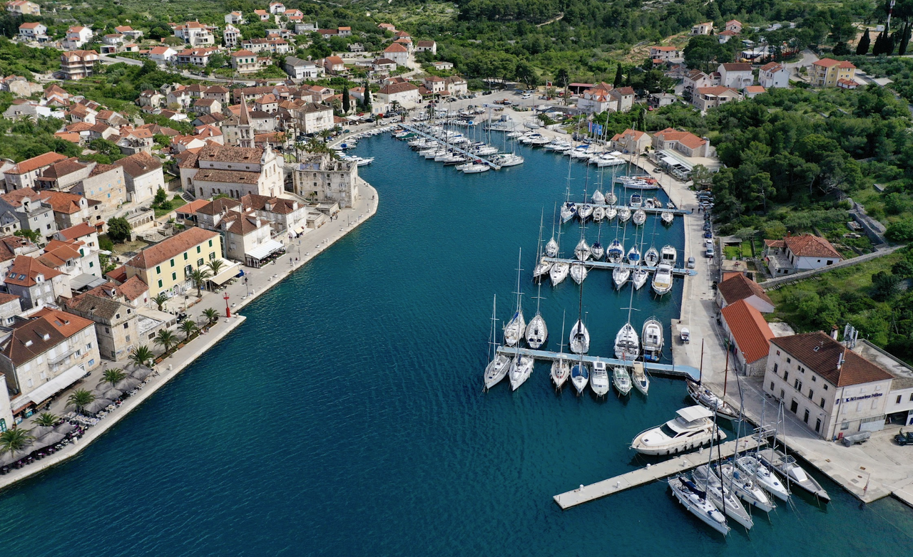

### Запасные стоянки

**Uvala Makarak** - защищённая якорная стоянка в северной части бухты Милны. Глубина 5–7 м, грунт — песок и ил, якорь держит хорошо. Стоянка подходит при любом направлении ветра, кроме сильного ветра с запада.

`Координаты: 43° 19.45' N, 16° 25.87' E`

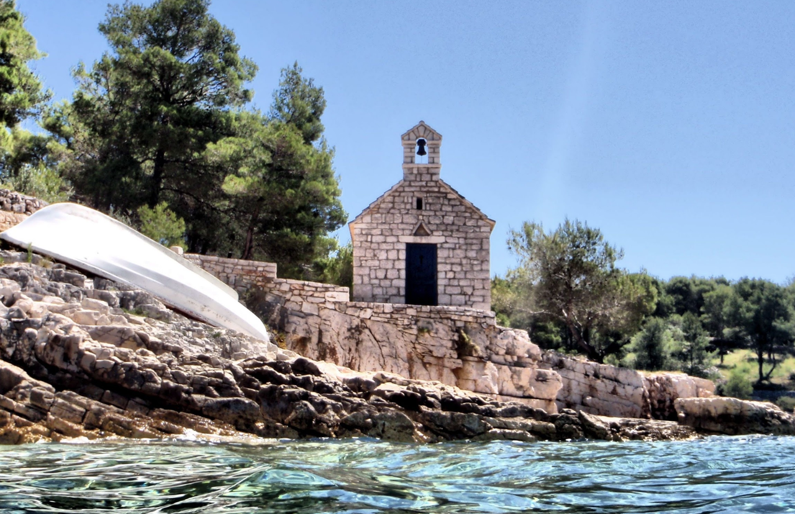

**Lučice bay** - уютная небольшая бухта к востоку от марины, идеальна для спокойного вечера. Глубина 4–6 м, мягкий грунт из песка и ила. Расстояние до основной марины составляет примерно 1 км.

`Координаты: 43° 18.62' N, 16° 26.75' E`

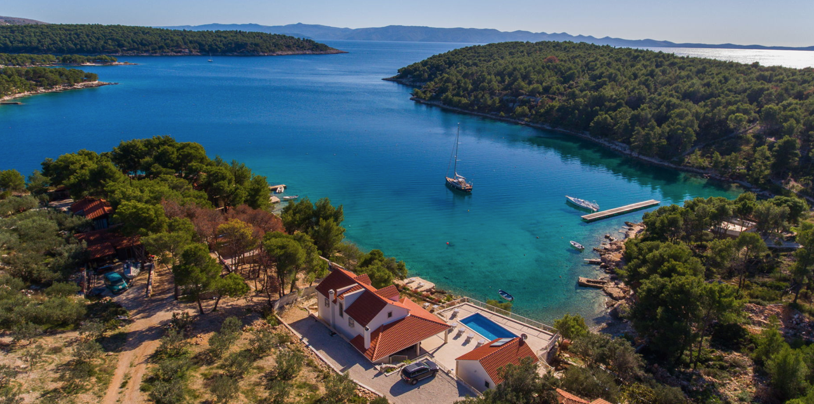

**Marina Vlaska** - альтернативная якорная стоянка с хорошей защитой. 70 мест. Вода, электричество, душь и туалет. 

**VHF Channel 16**.

`Координаты: 43° 19.77' N, 16° 26.38' E`

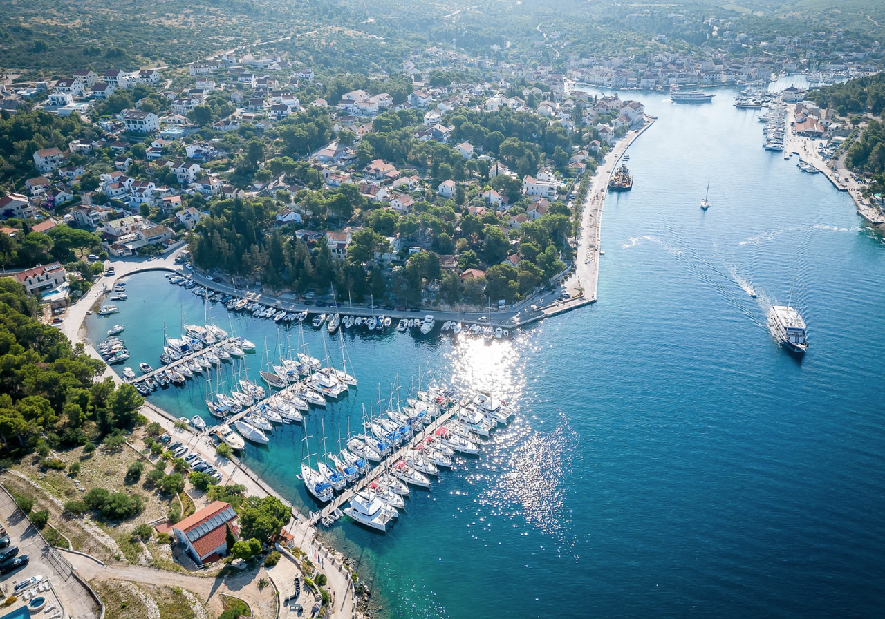
---

## Другие марины на острове 

**Пучишка (Pučišća)** — один из старейших портов острова Брач, исторически известный как центр производства славянского камня. Небольшой живописный порт на северном побережье острова. Яхты швартуются вдоль набережной рядом с традиционными каменными домами. Хорошо подходит для любителей истории и культуры. Глубина в гавани 4–6 м, грунт — камень и песок. ***VHF Channel 17.***

`Координаты: 43° 20.92' N, 16° 44.00' E`

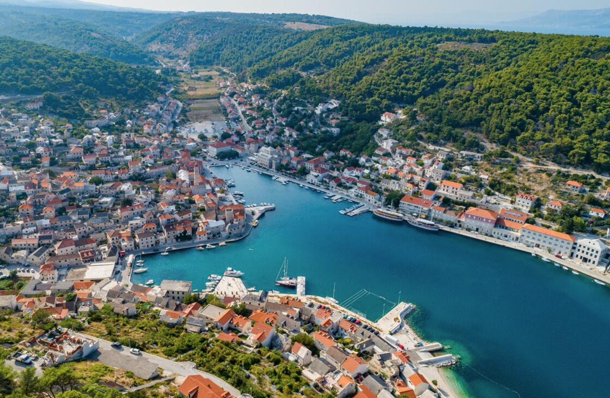

**Marina Bol** — расположена в курортном посёлке Бол на южном побережье острова Брач. Это современная и хорошо оборудованная марина, рассчитанная примерно на 50 яхт. Входит в сеть ACI Marina. Полный спектр услуг, включая техническое обслуживание и заправку топливом. Вблизи марины находятся рестораны, магазины и пляжи. Рекомендуется для комфортной длительной стоянки.
***VHF Channel 9.***

`Координаты: 43° 15.62' N, 16° 39.32' E`

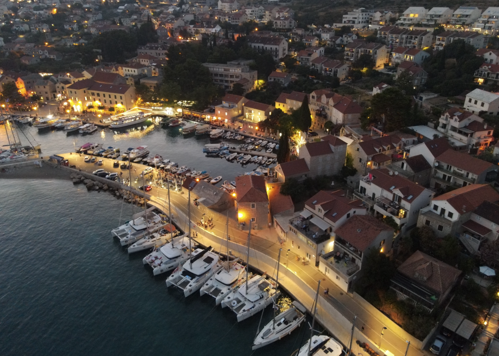

---

## Достопримечательности

### Церковь Благовещения (Church of Our Lady of Annunciation)

Главный храм посёлка Милна, построенный в XVI веке и перестроенный в XVIII столетии. Церковь расположена на холме над портом и является яркой белой доминантой, видимой с моря издалека. Внутри сохранились фрески и алтари барочного периода. Прогулка к церкви по каменным лестницам поселения предоставляет панорамные виды на порт и окружающие острова. Особенно красива церковь на закате солнца.

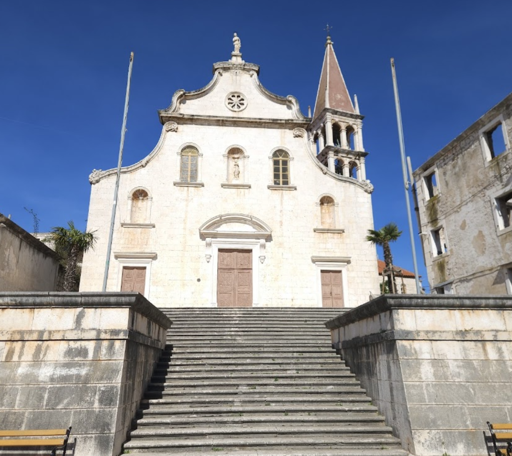

---

### Старая набережная и каменный центр

Сама Милна — главная достопримечательность поселения. Узкие каменные улочки, исторические дома с красной черепицей и традиционная набережная создают аутентичную атмосферу адриатического портового поселения. На набережной расположены кафе и рестораны, где можно попробовать традиционные далматинские блюда и локальные вина. Особенно атмосферно здесь вечером, когда местные жители собираются на «пасео» (традиционный вечерний променад).

---

### Винодельни острова Брач

**Stina Winery (Bol)** — семейная винодельня в курортном посёлке Бол (20–25 км от Милны). Производит высококачественные вина из автохтонных сортов: Пошип, Далматинец и Негра. Виноградники расположены на склонах с выходом на Адриатическое море.

**Время работы:** апрель–октябрь. **Дегустация:** €15–25 за человека (3 вина + закуски, 60–90 минут). Вина можно купить напрямую (€8–18 за бутылку).

**Контакты:** Тел. +385 21 635 500 | Email: info@stinawinery.com 

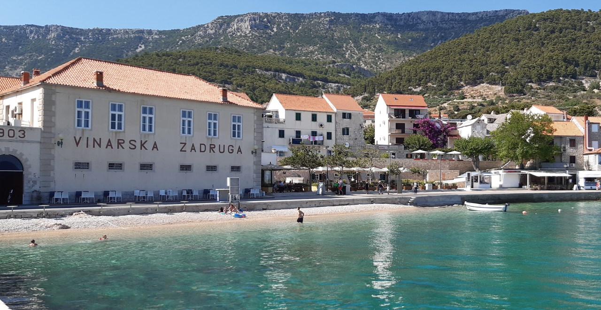

### Веломаршрут и виноградники острова Брач

Милна является идеальной стартовой точкой для велопрогулок по острову Брач. Маршруты ведут через виноградники, оливковые рощи и небольшие деревни. По дороге можно посетить семейные винодельни, где хозяева охотно делятся историей местного виноградарства. Велосипеды можно арендовать в центре **Милны**.

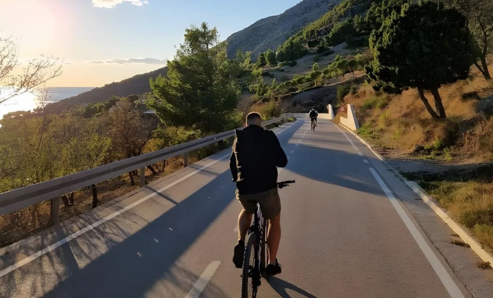

### Golder Horn Beach

Один из самых красивых и диких пляжей острова Брач, расположенный в бухте Золотого рога на восточной стороне острова (примерно 15–20 км от Милны). Пляж получил своё название благодаря золотистому цвету песка и необычной форме береговой линии, напоминающей рог. Это идеальное место для любителей природы и спокойного отдыха, вдали от туристических толп.

Бухта защищена от большинства ветров и отличается кристально чистой водой изумительного голубого цвета. Глубина постепенно увеличивается, что делает пляж безопасным для семей с детьми. Вода прогревается до 26–27°C в летний период. Пляж преимущественно каменисто-песчаный, рекомендуется использовать пляжные тапочки.

`Координаты: 43° 14.95' N, 16° 36.22' E`

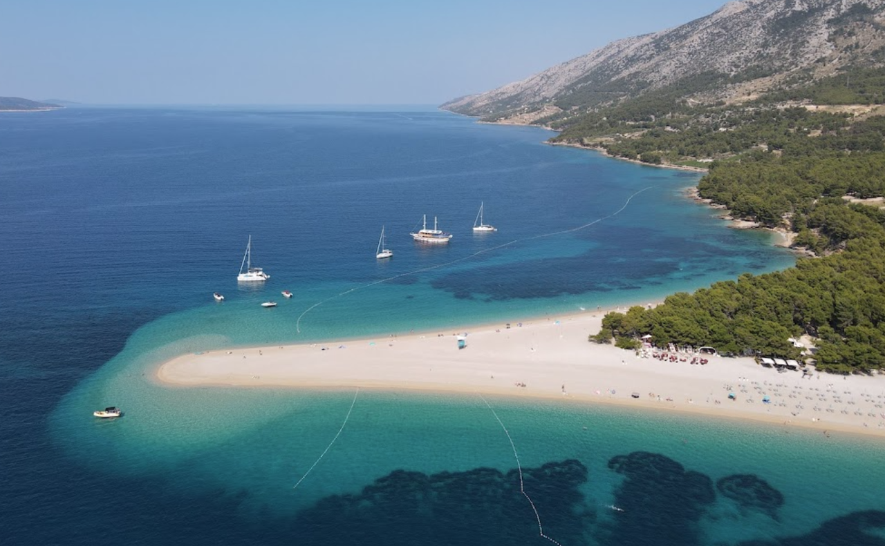

### Пляжи и купание

В окрестностях Милны находятся несколько небольших скалистых пляжей с кристально чистой водой. Лучшие места для купания расположены на расстоянии 100–300 метров от порта. Вода прогревается с июня по сентябрь до комфортной температуры 25–27°C. Возможно купание прямо с яхты в глубоководных местах.

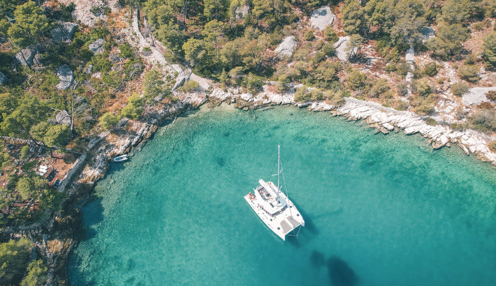

---
