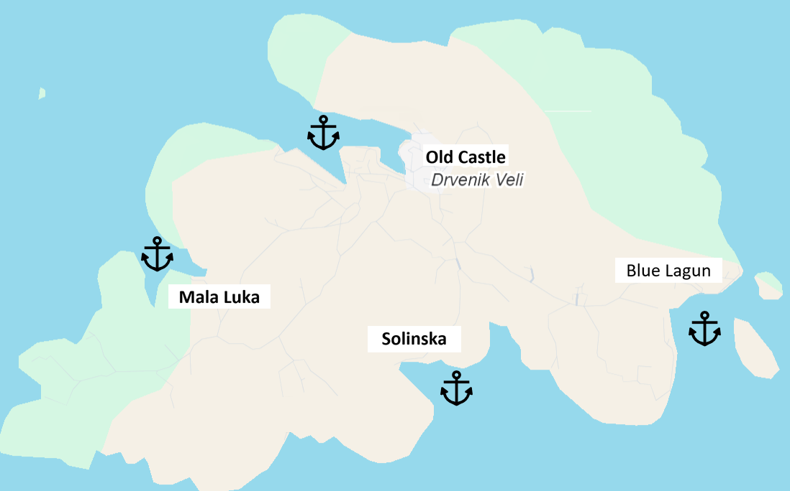
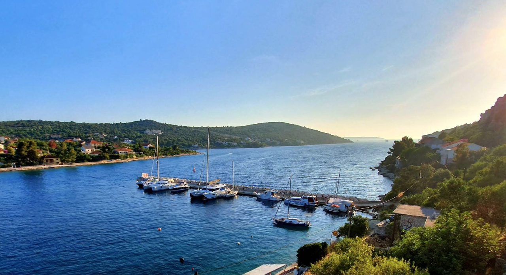
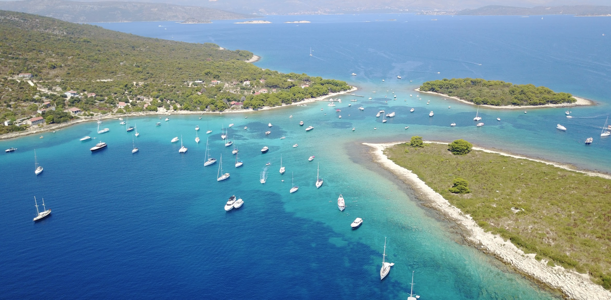
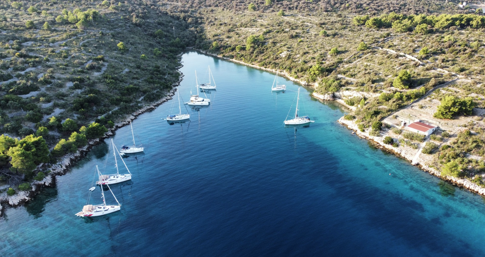
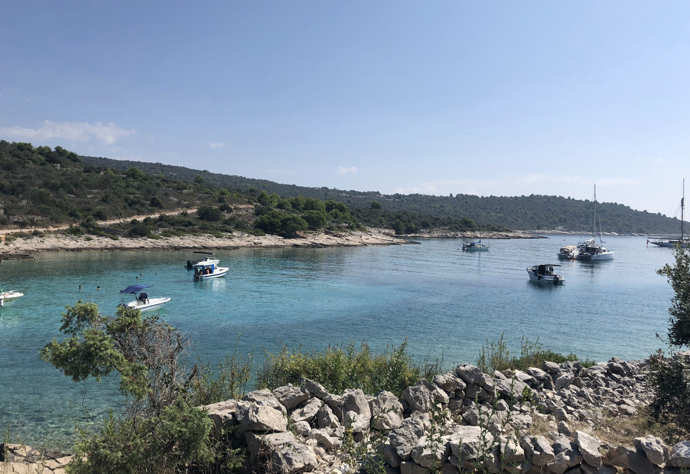
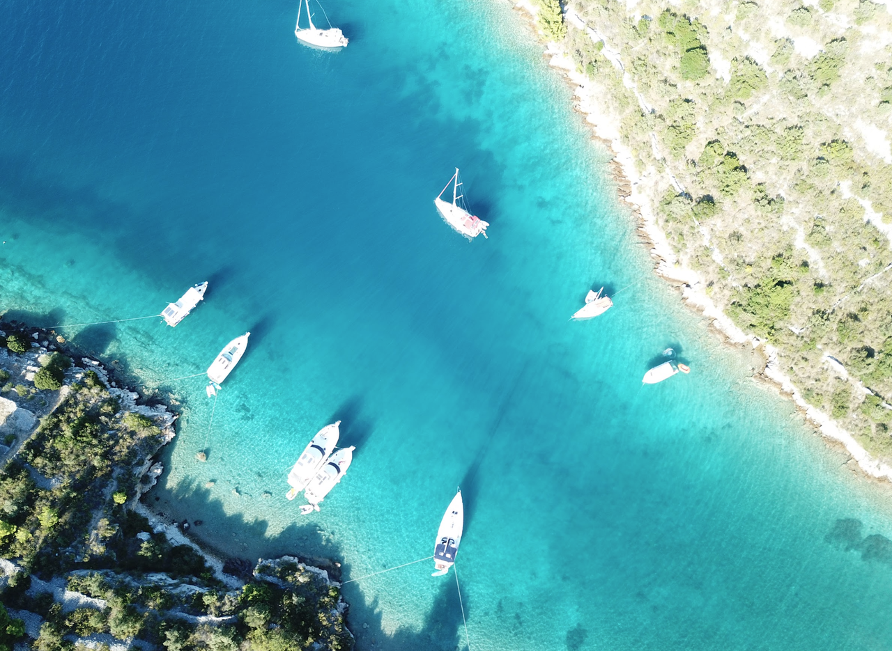
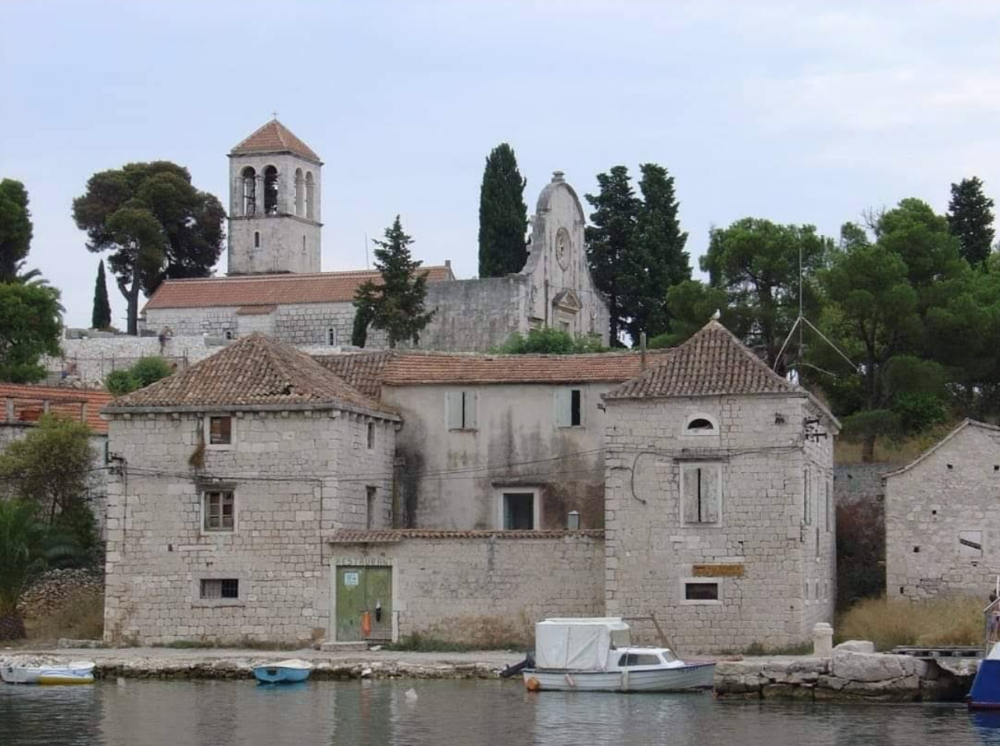
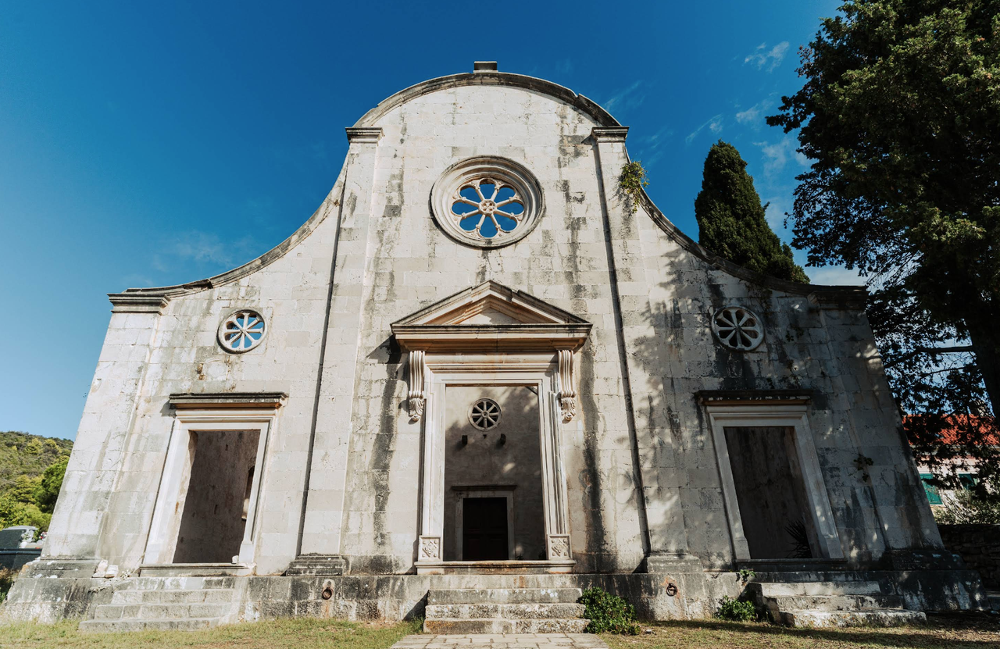

**Вели Древник (Drevnik Veli)** — больший остров архипелага Древнских островов, расположенный в 12–18 км от Сплита. Остров известен своей современной мариной и одной из самых красивых якорных стоянок Адриатики — **Blue Lagoon**, где вода сияет потрясающим голубым цветом. Это идеальное место для яхтсменов, ищущих сочетание комфорта и природной красоты. Остров практически не населён, сохраняя первозданный характер средиземноморского острова.

История острова связана с рыболовством и морским торговлем. В прошлые века здесь жили местные рыбаки и мореходы. Сегодня остров развивается как яхтенный центр, привлекая владельцев парусников и моторных яхт благодаря современной инфраструктуре и естественной красоте.

## Марины и якорные стоянки

Drevnik Veli располагает причалами в деревне и несколькими естественными, хорошо защищёнными якорными стоянками. Остров идеален как для кратковременной стоянки перед возвращением в Сплит или Трогир, так и для более длительного пребывания.

---

### Причалы в деревне (Drevnik Veli Port)

Стоянка у причала в деревне на восточной стороне острова. Довольно популярная ночёвка перед возвращением в Сплит или Трогир. Места ограничены: примерно 10–15 мест у главного причала и ещё 10–15 мест дальше в глубь бухты.

Стоимость: примерно €20–35 за ночь в зависимости от сезона. Электричество и вода доступны.

В непосредственной близости: рестораны, кафе, небольшие магазины, почта. Возможна аренда велосипедов и услуги ремонта.

`Координаты: 43° 14.85' N, 16° 31.45' E`

---

### Blue Lagoon — якорная стоянка

Главная достопримечательность и любимая якорная стоянка — легендарная **Голубая лагуна**. Расположена на западной стороне острова. Защищённая якорная стоянка идеальна при любых направлениях ветра. Глубина 8–12 м, грунт — песок и ил, якорь держит отлично.

Вода в лагуне сияет кристально чистым голубым цветом, что создаёт потрясающий визуальный эффект. Видимость превышает 35 м, что делает её идеальной для снорклинга и подводного плавания.

`Координаты: 43° 26.27' N, 16° 10.38' E`

---

### Mala Luka — защищённая бухта

Защищённая и менее известная бухта на западной стороне острова. Бухта глубоко врезается в берег и разделяется на два рукава, создавая очень уютную и защищённую стоянку. Глубина 6–10 м, грунт — песок и ил. Здесь обычно тише и спокойнее, чем на Blue Lagoon.

`Координаты: 43° 26.57' N, 16° 7.38' E`

## Достопримечательности

### Побережье и бухты для купания

Всё побережье острова славится множеством живописных бухт и мест для купания. От маленьких скрытых пляжей до просторных бухт — каждый найдёт себе место по душе. Вода везде кристально чистая, температура в летний период 25–27°C. Рекомендуется исследовать побережье на тендере или прогулочном катере, открывая всё новые уютные укрытия.

---

### Solinska — рыбацкая бухта

Живописная рыбацкая бухта на побережье острова, известная как место сбора местных рыбаков и яхтсменов. Здесь можно увидеть традиционные рыбацкие лодки и познакомиться с локальным образом жизни. Вода в бухте кристально чистая, идеальна для купания. На берегу расположены небольшие кафе и рестораны, где подают свежую рыбу и традиционные далматинские блюда.

---

### Mala Luka — лагуна и рыбацкая бухта

Защищённая и менее известная бухта на западной стороне острова. Бухта глубоко врезается в берег и создаёт очень уютную и защищённую стоянку, разделяясь на два рукава. Здесь обычно тише и спокойнее, чем на Blue Lagoon, что делает её идеальным местом для тех, кто ищет уединения. Вода тёплая и прозрачная, отличное место для снорклинга и начинающих пловцов.

---

### Old Castle — развалины замка

На острове сохранились руины древнего замка, который служил оборонительной структурой в период средневековья. Развалины датируются примерно XV–XVI веками и представляют интерес для любителей истории и фотографии. С развалин открываются панорамные виды на Адриатику и соседние острова. Доступ по пешеходной тропе от деревни.

---

### Church of St. George — Церковь Св. Георгия

Небольшая историческая церковь на острове, датируемая XVII веком. Церковь Св. Георгия является одной из главных духовных достопримечательностей Drevnik Veli и служит центром для местной общины. Архитектура церкви отражает характерный далматинский стиль с белокаменными стенами и колокольней. Рядом с церковью находится небольшое кладбище с историческими надгробиями. Вход свободный.

