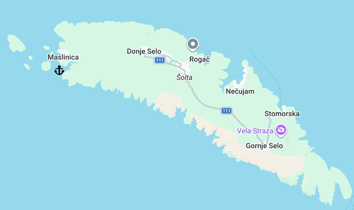
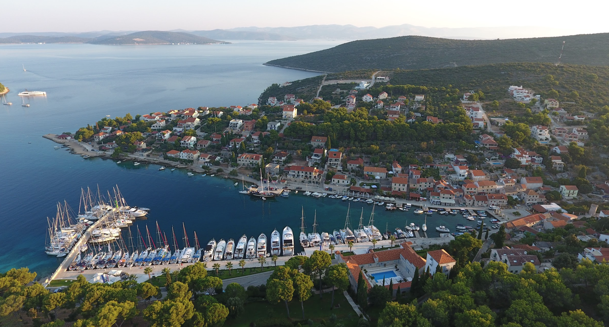
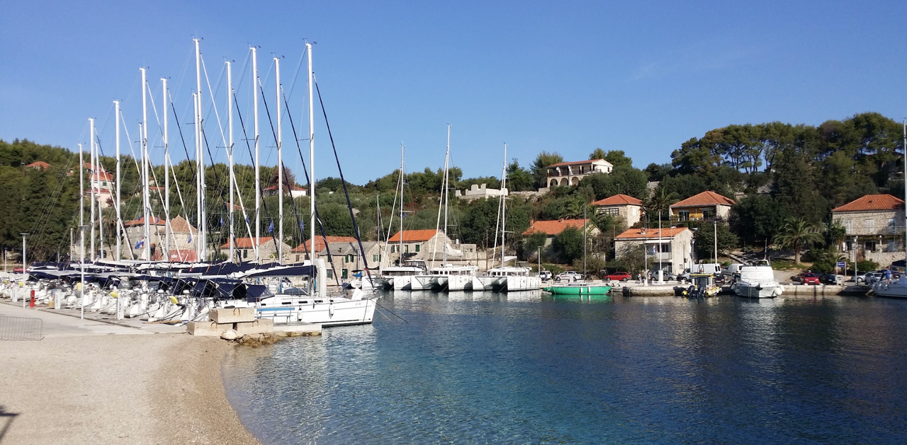
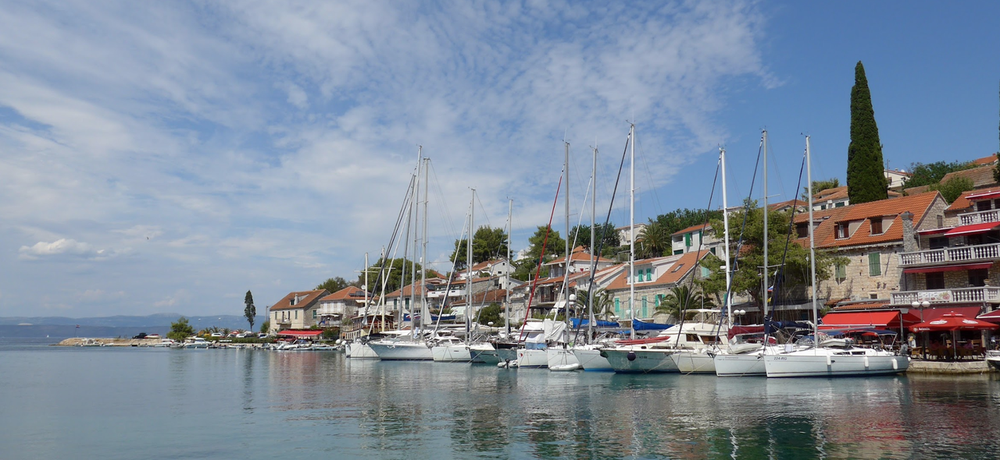
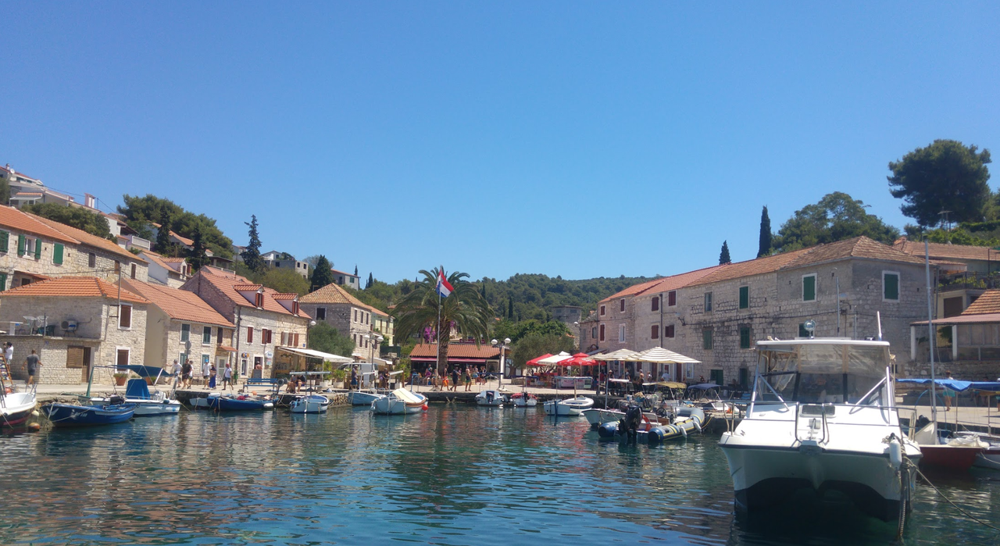
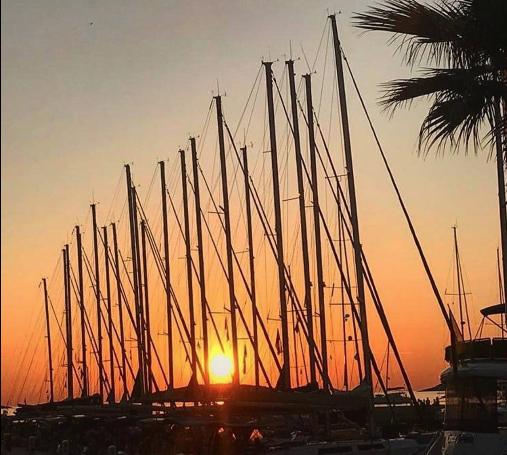
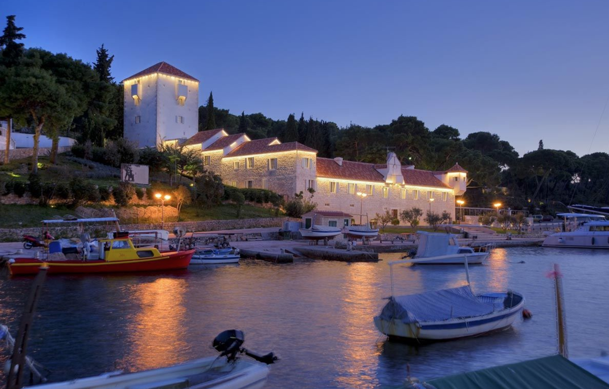
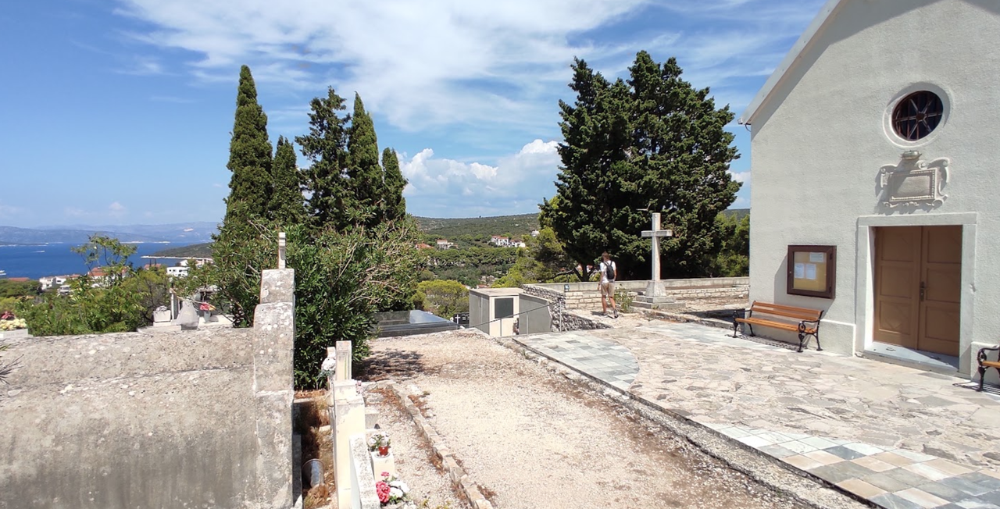

**Маслиница** — живописная портовая деревня на острове **Шолта** в заподной части острова, известная своей гостеприимной атмосферой и удобством для яхтинга. Это спокойное средиземноморское поселение с характерными каменными домами, красивой набережной и кристально чистой водой, идеально подходящее как для однодневной остановки, так и для более продолжительного пребывания.

История Маслиницы тесно связана с морем и рыболовством. На протяжении столетий деревня оставалась важным портом для местных рыбаков, а сегодня развивается как туристический центр, сохраняя при этом подлинный характер аутентичного адриатического поселения. Окружающие виды на соседние острова и материковое побережье делают Маслиницу одной из самых живописных стоянок региона.

## Марины и якорные стоянки

Основной порт деревни находится в защищённой бухте на северо-западной стороне острова, куда яхты могут входить как днём, так и для ночёвки. Подход безопасен и хорошо обозначен навигационными вехами. Глубина в гавани варьируется от 3–4 м у берега до 8–10 м в центре; грунт преимущественно песок с илом, якорь держит надёжно. Летом обычно доступны буи для швартовки.

### Martinis Marchi Marina

Современная марина в центре Маслиницы, рассчитанная примерно на 40–50 яхт. Это основное место стоянки для яхтсменов, желающих оказаться в центре жизни деревни с максимальным доступом к услугам и развлечениям.

Стоимость стоянки варьируется в зависимости от сезона: летний период (июнь–сентябрь) — примерно €45–70 за ночь, межсезонье — €30–45. Цена включает подвод электричества и пресной воды. Марина хорошо защищена от большинства направлений ветра, особенно от западных и северо-западных штормов, однако при сильном северо-восточном ветре комфорт стоянки может снизиться.

Непосредственно у пирса расположены рестораны, кафе и небольшие магазины. В 50–100 метрах от марины находятся аптека, почта и банкомат. Доступна АЗС с пресной водой и топливом.

`Координаты: 43° 00.50' N, 16° 22.15' E`

### Запасные стояники

**Rozhledna Maslinica** - якорная стоянка, растяжка
`Координаты: 43° 23.65' N, 16° 12.80' E`

**Martinis Marchi Marina**  возможна якорная стоянка в открытой части бухты. Глубина 6–8 м, грунт — песок и ил, якорь держит хорошо. Стоянка подходит при спокойном море и отсутствии сильного ветра. Расстояние до марины и берега составляет 150–200 м, что позволяет легко добраться на тендере.

`Координаты: 43° 00.35' N, 16° 22.00' E`

---

## Другие марины на острове 

**Порт Рогач (Luka Rogač)** - это главные морские ворота острова Шолта. Именно сюда приходят паромы из Сплита.
**Marina Rogač** - можно использовать как резервную марину. Все удобства но место не моного, 20 мест для стоянки у причала. Заправка дизелем. ***VHF Channel 17.***

`Координаты: 43° 23.73' N, 16° 17.93' E`

**Стоморска (Stomorska)** - считается одним из самых живописных и аутентичных портов Шолты. Небольшая природная бухта на северо-восточном побережье острова. Исторически это рыбацкий порт, сохранивший свой традиционный характер.
Яхты швартуются прямо вдоль набережной рядом с кафе и ресторанами.

`Координаты: 43° 22.27' N, 16° 21.17' E`

---

## Достопримечательности

### Маслиница и набережная
Сама деревня — главная достопримечательность. Прогулка по узким каменным улочкам, посещение небольшой церкви на холме и отдых на набережной дарят ощущение подлинной Адриатики. 

### Закат над Адриатикой
Маслиница славится одними из самых красивых закатов в регионе. На закате вода приобретает золотистый оттенок, а контуры соседних островов создают живописный силуэт против оранжевого неба. Лучший вид открывается с борта яхты или с набережной ресторана.

### Martinis Marchi Heritage Hotel 
Cамый известный исторический отель на острове Шолта, расположенный в центре Маслиницы.Отель находится в восстановленном замке семьи Марки, построенном в 1708 году для защиты поселения от пиратских нападений.

---

### Церковь Святого Николая (Church of St. Nicholas) 
Находится на холме над Маслиницей и является одной из главных исторических достопримечательностей поселка. Церковь была построена семьёй Марки, той же семьёй, которая возвела замок Martinis Marchi в Маслинице. Расположена на самой высокой точке к югу от бухты Маслиницы. Отсюда открываются великолепные панорамные виды на гавань, марину, архипелаг небольших островков и Адриатическое море. До церкви можно добраться пешком по живописной тропе из центра посёлка.

---
