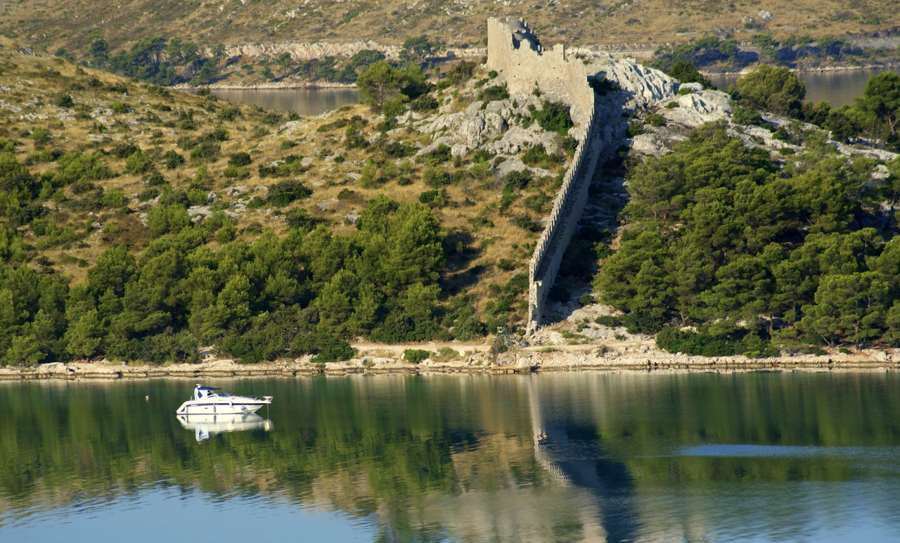
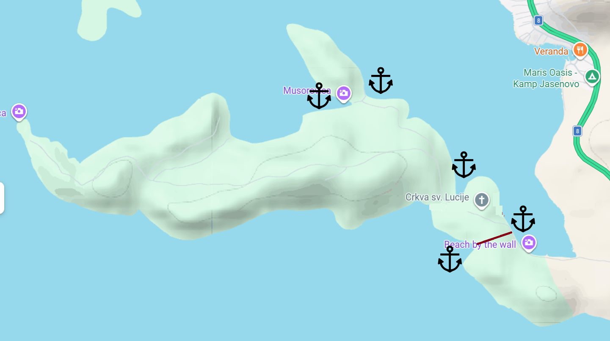
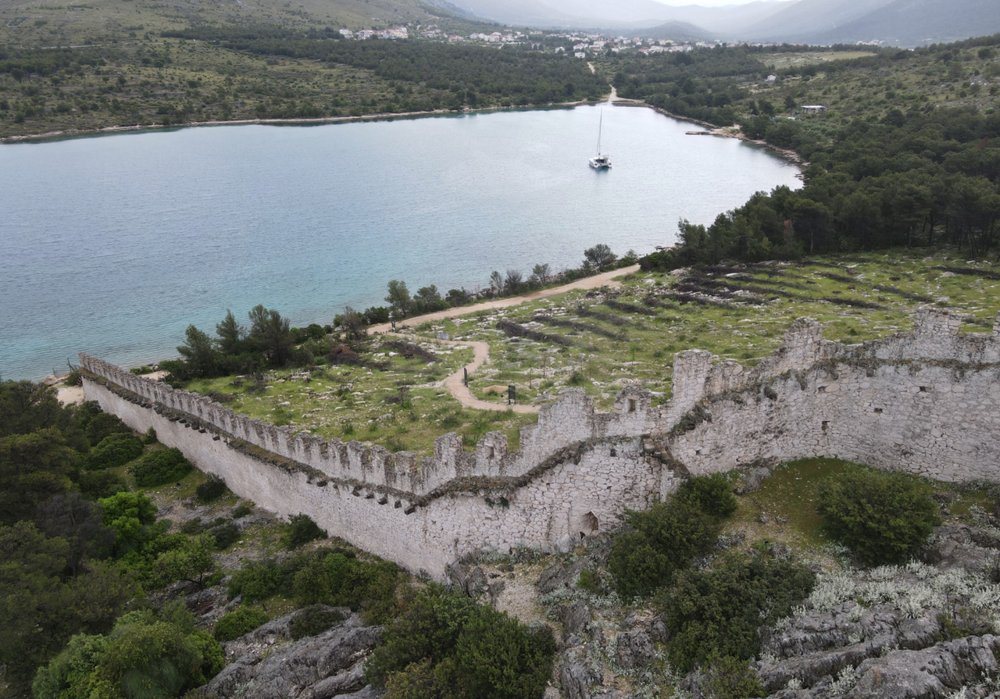
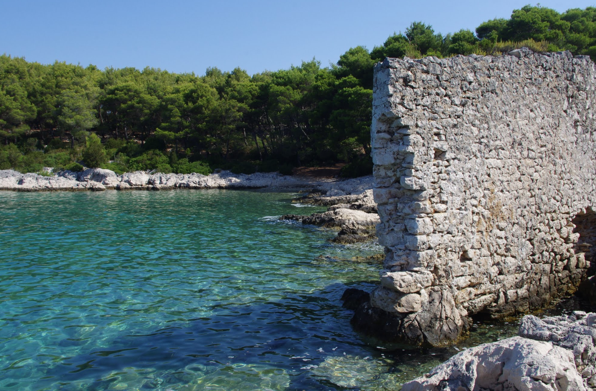
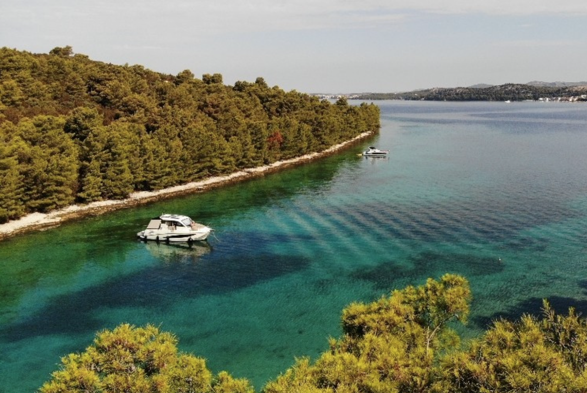
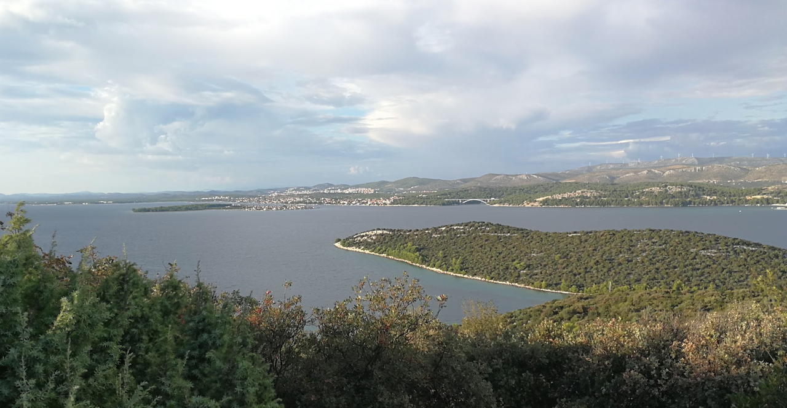
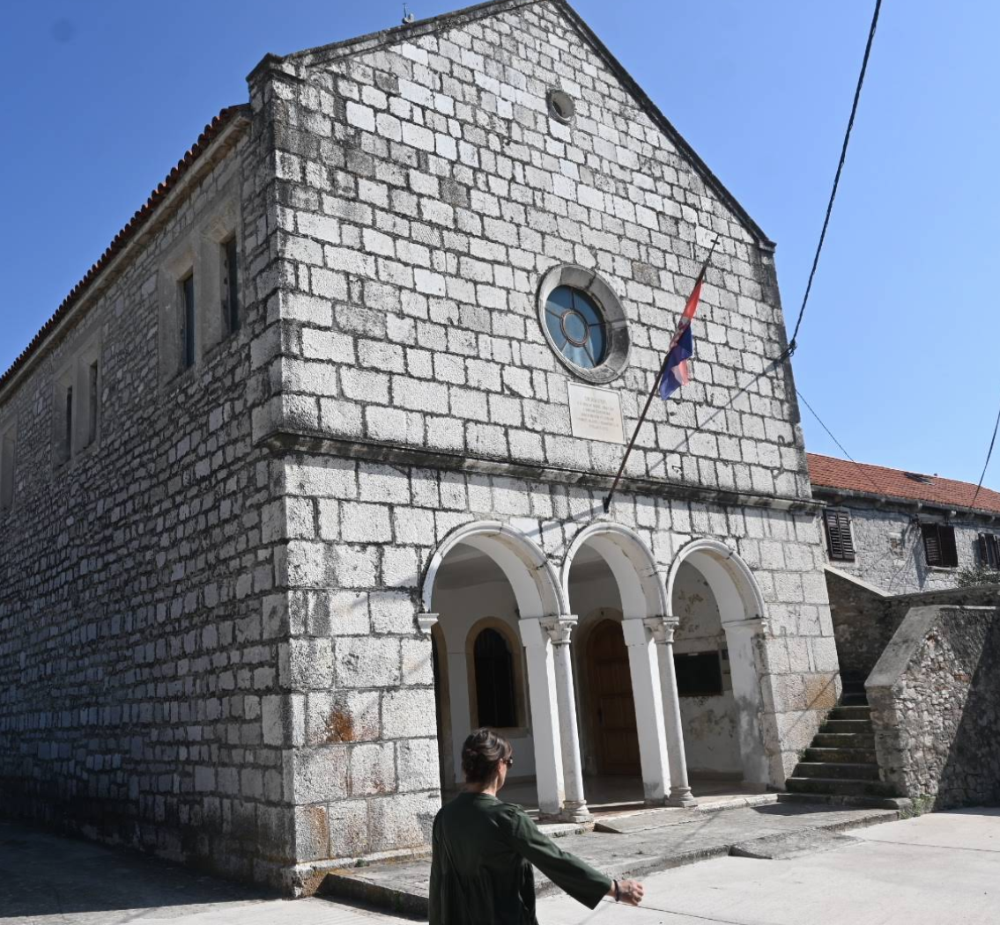
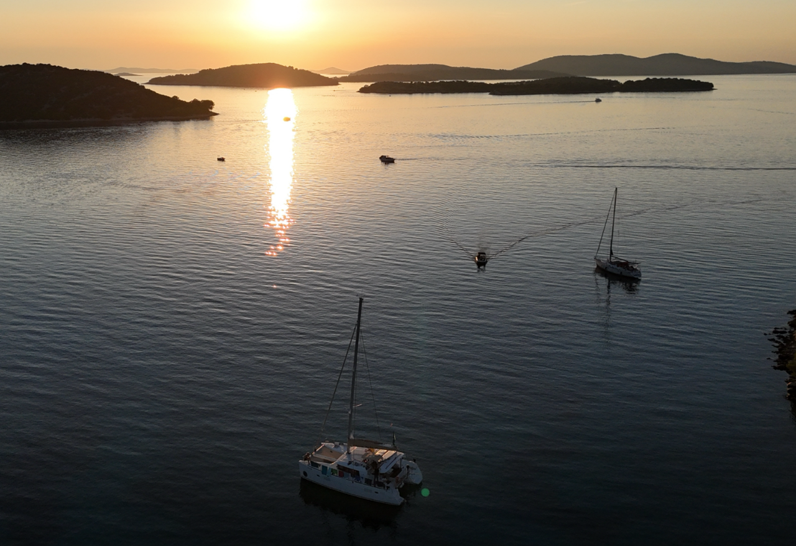

**Оштрица (The Wall of Oštrica)** — является одной из малоизвестных исторических достопримечательностей побережья между Примоштеном и Шибеником.

Многие чартерные экипажи проходят мимо Гребаштицы по дороге в Шибеник и Крку, даже не подозревая, что здесь сохранилась такая редкая достопримечательность оборонительной архитектуры Далмации. Поэтому место считается своего рода «секретной жемчужиной» яхтенного побережья.

Стена расположена на полуострове Оштрица у входа в залив Гребаштица и была построена для защиты местного населения от нападений Османской империи. Стена перекрывала самый узкий участок полуострова, создавая оборонительный барьер на подступах к поселению.

## Якорные стоянки

**Bedem Grebaštica** предоставляет несколько основных якорных стоянок с северной и южной стороны стены. Обе стоянки хорошо защищены и предлагают различные условия в зависимости от направления ветра.

---

### **Северная якорная стоянка**

Защищённая якорная стоянка на северной стороне стены. Эта стоянка идеальна при южных и юго-восточных ветрах. Глубина 8–12 м, грунт — камень, часто с водорослями и песком в углублениях. Якорь держит при правильной расстановке. Видимость подводного мира отличная благодаря чистоте воды.

Хорошая защита от южных штормов, открыта северным ветрам. Рекомендуется при слабых северных ветрах. Стена создаёт впечатляющий вид с борта яхты.

Чуть дальше в глубь континента есть причал для высадки. Берег у стены для высадки не комфортен. 

`Координаты: 43° 38.53' N, 15° 56.85' E`

---

### **Южная якорная стоянка**

Защищённая якорная стоянка на южной стороне стены. Эта стоянка идеальна при северных и северо-восточных ветрах. Глубина 6–10 м, грунт — песок и ил, якорь держит отлично. Расстояние от стены примерно 200–300 м.

Хорошая защита от северных ветров, открыта южным ветрам. Рекомендуется при слабых южных ветрах или при спокойном море. Более мягкий грунт для якоря, чем на северной стороне.

`Координаты: 43° 38.45' N, 15° 56.40' E`

---

### **Резервная якорная стоянка**

Западнее южной стоянки есть комфортная бухта с возможностью высадки на тендере. Также комфортно будет пройти по дороге через церковь **St. Lucy's**. Дорога поднимается в гору, необходима соответствующая обувь. 

`Координаты: 43° 38.30' N, 15° 55.20' E`

---

### **Musorovica — якорная стоянка**

Удобная бухта с северо-запада представляет якорную стоянку с песчаным и местами каменистым дном, с возможностью высадки на берег на тендере и доступом к пляжу. Есть выход к дороге. Расстояние до стены 2 км. Дорога проходит через церковь **St. Lucy's**.

`Координаты: 43° 38.98' N, 15° 55.73' E`

## Достопримечательности

### **St. Lucy's Церковь**

Церковь Святой Лючии (Crkva sv. Lucije) на полуострове Велика Оштрица возле Гребаштицы, рядом с крепостной стеной Bedem. Доступ по дороге с запада от стены. 

---

### **Закат и природные красоты**

Вечер у стены Bedem Grebaštica предоставляет одни из самых впечатляющих закатов в Адриатике. Контур стены против оранжевого неба, отражение в спокойной воде — природный шедевр. Рекомендуется оставаться на якоре до заката.

