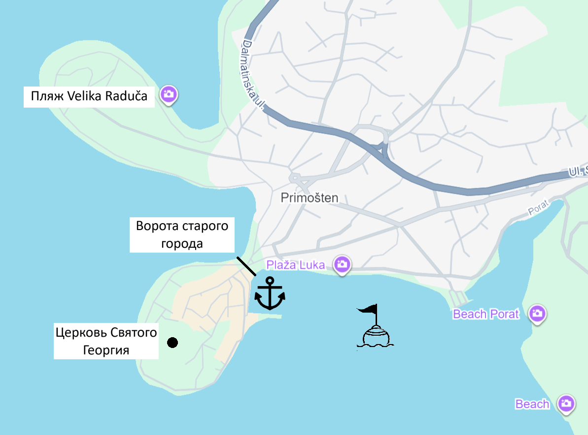
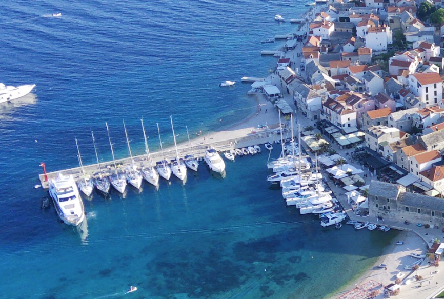
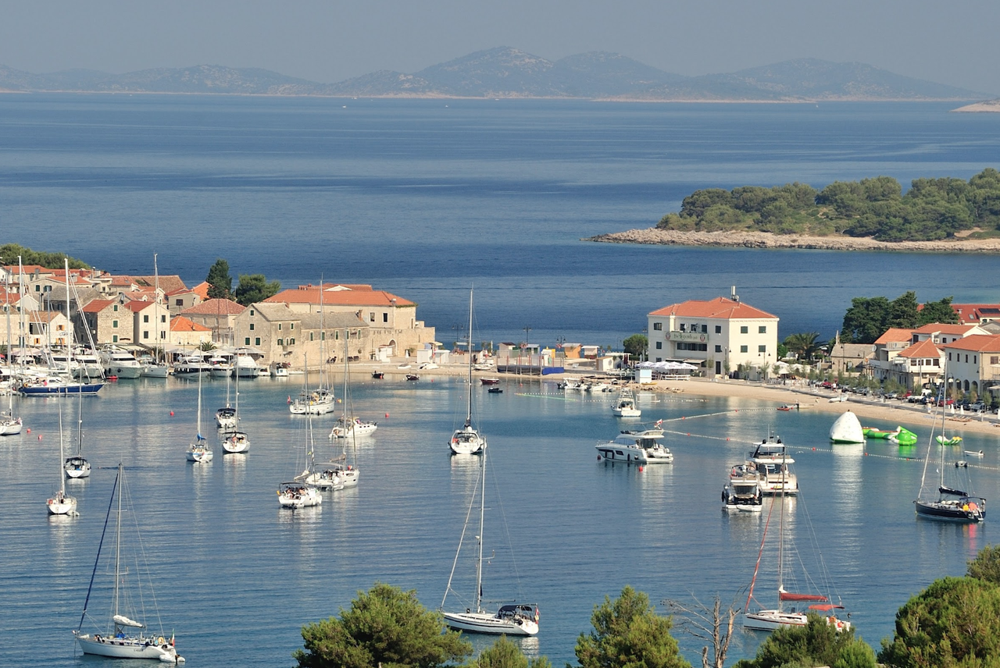
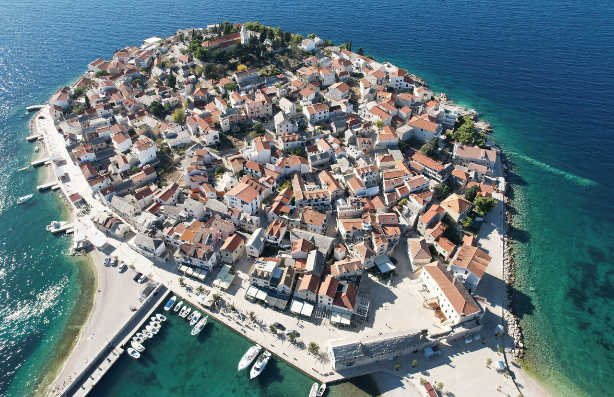
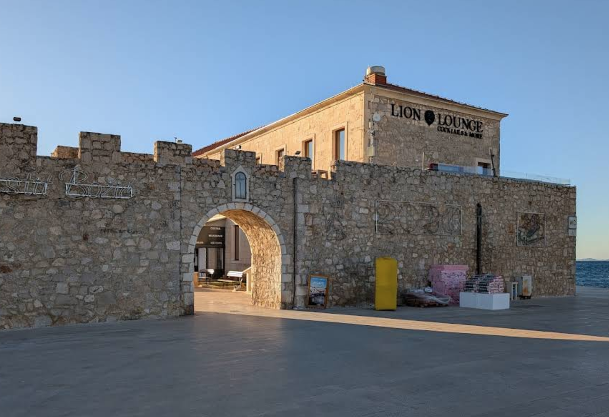
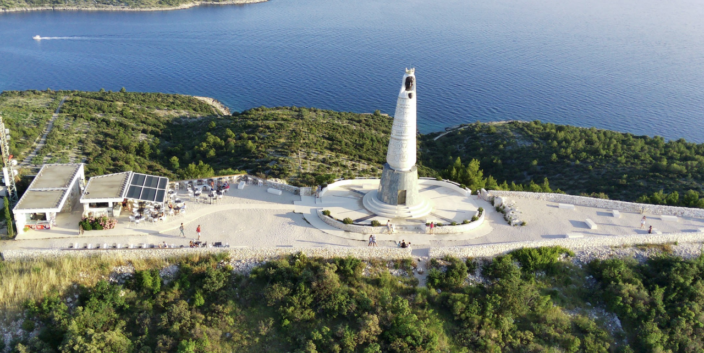
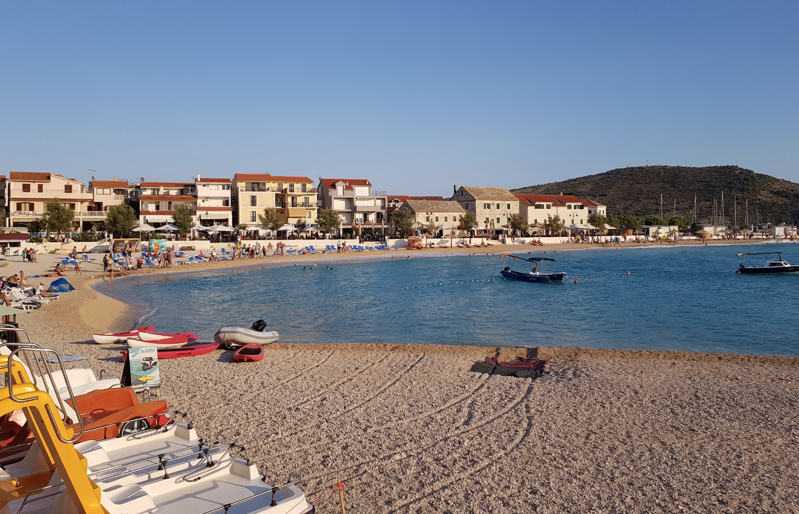
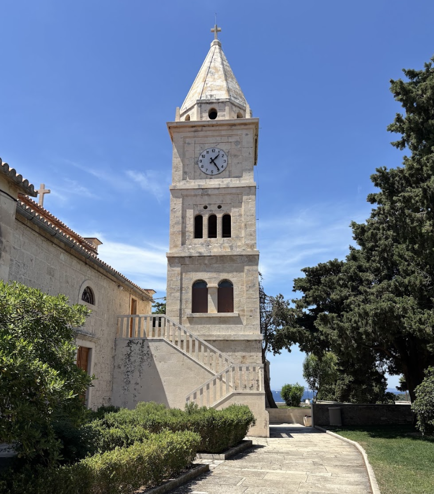

**Примоштен** — небольшой, но очень живописный городок на полуострове в северной Далмации, известный белыми домами, узкими каменными улицами и защищённой бухтой. Он особенно популярен среди яхтсменов как удобная остановка на пути между Шибеником и Рогожницей.

Для кратких ночёвок и прогулок по старому городу здесь особенно ценится стоянка на буях: она позволяет находиться в центре событий, не занимая место в марине и не тратя время на переправу к берегу.

## Городская марина

Городская марина у старого города (**Primosten Town Quay**) считается одной из самых привлекательных стоянок на побережье Шибеникской ривьеры. По отзывам яхтсменов, главное достоинство этого места — не столько сама инфраструктура, сколько атмосфера.

Инфраструктура оценивается как хорошая: доступны вода, электричество, душевые, туалеты, а рядом находятся магазины и рестораны. Однако некоторые владельцы яхт отмечают сложности с предварительным бронированием мест и советуют резервировать швартовку заранее. Также встречаются замечания, что на буях лодка может заметно покачиваться даже в спокойную погоду.

`Координаты: 43° 35.12' N, 15° 55.40' E`

## Стоянка на буях

Основной вариант стоянки в Примоштене для проходящих яхт — это буи в бухте перед старым городом. Небольшая, но защищённая гавань создаёт удобные условия для ночёвки и краткосрочной стоянки, особенно в хорошую погоду и при умеренном волнении.

Для яхтсмена это один из самых удобных способов провести ночь в красивом месте, когда важны не только безопасность и глубина, но и ощущение «быть на месте», рядом с ресторанами, кафе и видом на старый город.

Поскольку наличие буев и их актуальное состояние зависят от сезона и загруженности акватории, лучше уточнять места стоянки по рации или у местных капитанов перед подходом.

`Координаты: 43° 35.07' N, 15° 55.55' E`

## Достопримечательности

### Старый город и набережная

Центр Примоштена — это узкие переулки, исторические дома, маленькие площади и спокойная атмосфера типичного далматинского приморского поселения. Вечером город особенно красив: освещённые улицы, рестораны у воды и вид на бухту создают очень приятную обстановку после стоянки.

---

### Ворота старого города

Старинный вход в историческую часть Примоштена — один из характерных элементов местного облика. Здесь хорошо чувствуется атмосфера старого далматинского поселения: каменные стены, узкие проходы и ощущение, что город сохранил свой исторический ритм даже в самом центре туристической жизни.

---

### Смотровая площадка и статуя Богоматери Лоретской

Огромная статуя **Our Lady of Loreto** находится на холме над городом. С этой точки открывается один из лучших панорамных видов на Примоштен, ближайшие острова и побережье. Для туристов и яхтсменов это особенно удачное место: после прогулки по городу можно подняться наверх и увидеть бухту с высоты.

---

### Пляжи Velika Raduča и Mala Raduča

Это самые известные пляжи курорта с прозрачной водой, мелким песком и удобным входом в море. Velika Raduča особенно подходит для спокойного отдыха и плавания, а Mala Raduča — для более камерной атмосферы. Оба места хорошо дополняют прогулку по городу и особенно приятны после стоянки на буях.

---

### Церковь Святого Георгия

Небольшая, но очень характерная церковь Святого Георгия является важной частью культурного ландшафта Примоштена. Она хорошо вписана в силуэт города и особенно заметна при подходе к берегу, добавляя исторический контекст к прогулке по набережной и старым улицам.

