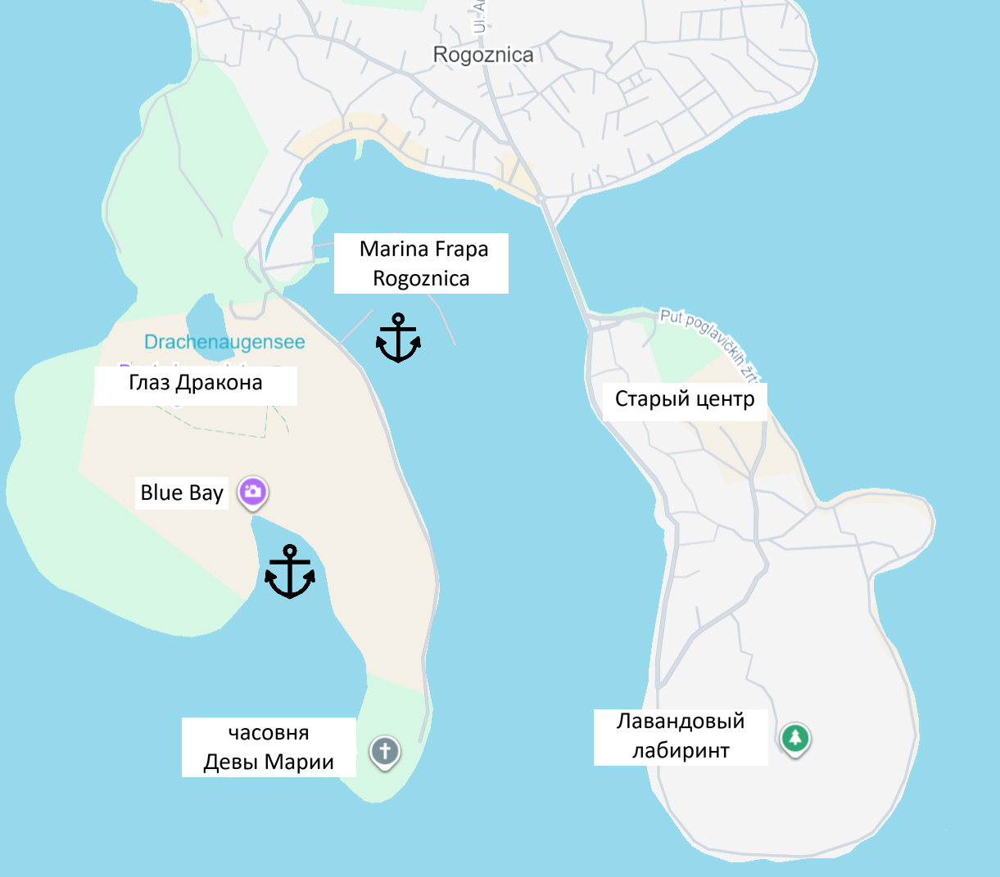
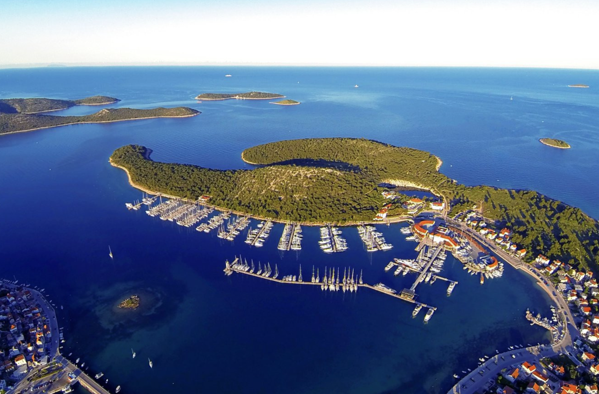

**Рогожница** — небольшой живописный портовый городок, расположенный в 30–35 км от Сплита между Сплитом и Шибеником. Это спокойное рыбацкое поселение с аутентичной атмосферой далматинского побережья. Город известен своей защищённой бухтой, которая идеально подходит для стоянки яхт, а также удобным расположением для изучения центральной Далмации и национального парка Крка.

История Рогожницы связана с рыболовством и торговлей. Городок сохранил подлинный характер традиционного адриатического портового поселения с узкими улочками, кафе и ресторанами на берегу. В последние десятилетия развивается как туристический центр, привлекая яхтсменов благодаря отличным условиям для стоянки.

## Марины и якорные стоянки

Рогожница имеет отличные естественные условия для стоянки яхт благодаря расположению в глубокой защищённой бухте. Подход безопасен при визуальной навигации. Глубина в бухте варьируется от 5–6 м у берега до 12–15 м в центре; грунт преимущественно песок и ил.

### ACI Marina Rogoznica

Современная и хорошо оборудованная марина, рассчитанная примерно на 100–120 яхт. Полный спектр услуг: причалы с электричеством и водой, техническое обслуживание, заправка дизелем и бензином, душевые, туалеты, ресторан и кафе.

Стоимость стоянки летом (июнь–сентябрь): €50–75 за ночь, межсезонье: €35–50. Цена включает электричество и пресную воду. Марина хорошо защищена от штормов благодаря расположению в узкой части бухты.

В непосредственной близости: рестораны, кафе, магазины, почта, банкомат, аптека. Возможна аренда велосипедов и скутеров.

`Координаты: 43° 30.85' N, 15° 57.95' E`

### Запасные стоянки

**North Bay** - защищённая якорная стоянка в северной части бухты. Глубина 7–9 м, грунт — песок и ил, якорь держит отлично. Укрытие от южных и юго-западных ветров.

`Координаты: 43° 31.15' N, 15° 57.75' E`

**South Bay** - якорная стоянка в южной части бухты с защитой от северных ветров. Глубина 6–8 м, песчаный грунт. Расстояние до города примерно 200 м.

`Координаты: 43° 30.55' N, 15° 58.15' E`

---

## Достопримечательности

### Портовая набережная и старый город

Узкие каменные улочки, рыбацкие лодки и портовая атмосфера создают типичный вид далматинского рыбацкого поселения. На набережной расположены небольшие кафе и рестораны, где подают свежую рыбу и традиционные далматинские блюда. Вечером атмосфера особенно живописна, когда возвращаются рыбацкие лодки.

### Пляжи и купание

Несколько пляжей расположены непосредственно в городе и его окрестностях. Лучшие места для купания находятся на расстоянии 50–200 м от центра. Вода кристально чистая, температура в летний период 25–27°C. Возможно купание прямо с яхты.

### Рыба и морепродукты

Рогожница славится свежей рыбой и морепродуктами. На набережной работают рестораны, где можно попробовать барабулю на гриле, дораду, каракатицу и другие местные деликатесы. Рекомендуется ужин на закате с видом на бухту.

### Близость к национальному парку Крка

Рогожница расположена в 15–20 км от входа в национальный парк Крка. Возможны однодневные экскурсии из города на лодке с посещением водопадов и озёр парка. Вход: €15.

---
