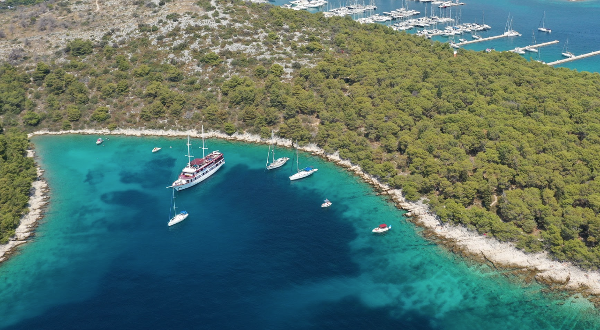
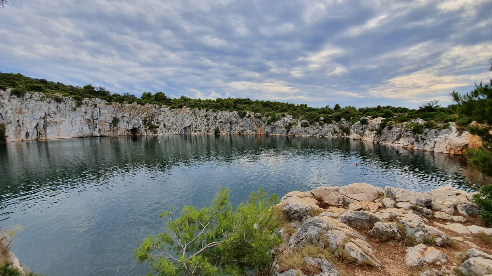
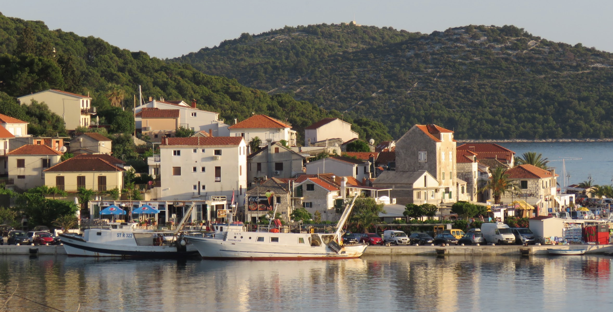
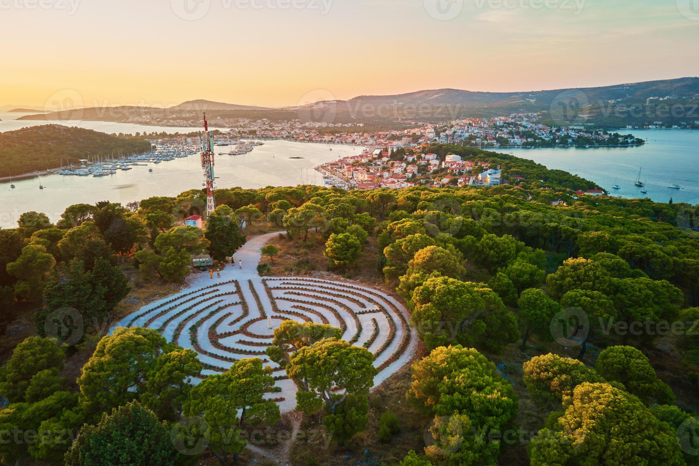
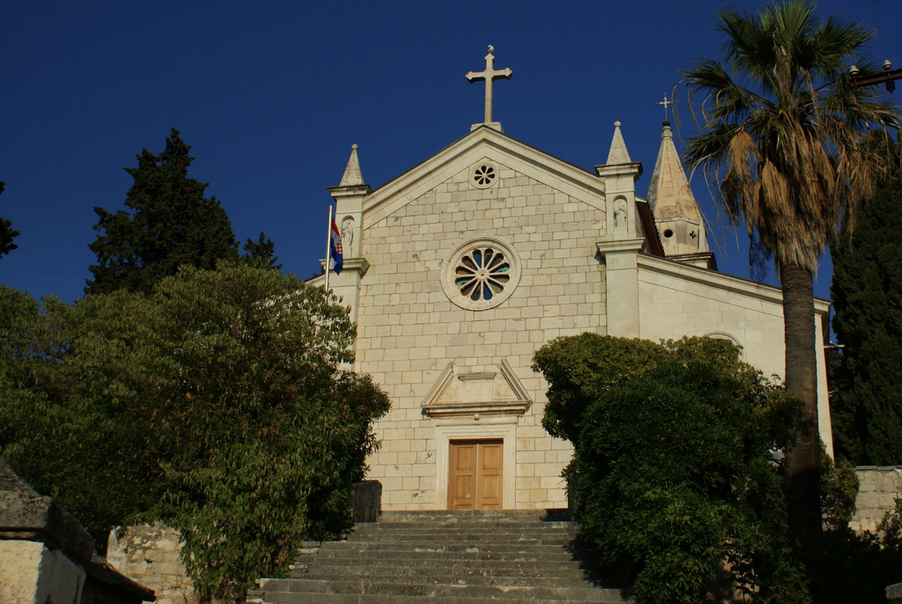
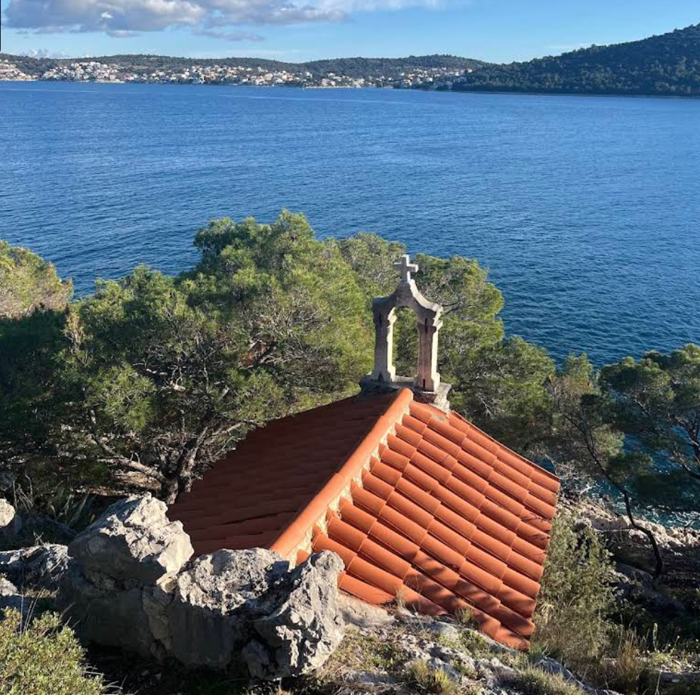

**Рогожница** — небольшой живописный портовый городок, расположенный в 30–35 км от Сплита, между Сплитом и Шибеником. Его береговая линия изрезана множеством небольших бухт, рядом с которыми находятся галечные и каменистые места для купания. Благодаря защищённой гавани Рогожница особенно популярна среди яхтсменов.

Одна из главных местных достопримечательностей — озеро «Глаз Дракона» (Dragon’s Eye). Это озеро окружено скалами высотой до 24 метров и связано с несколькими местными легендами, благодаря которым оно стало одной из самых узнаваемых достопримечательностей Рогожницы.

## Марины и якорные стоянки

Рогожница имеет отличные естественные условия для стоянки яхт благодаря расположению в глубокой защищённой бухте. Подход безопасен при визуальной навигации. Глубина в бухте варьируется от 5–6 м у берега до 12–15 м в центре; грунт преимущественно песок и ил.

### Marina Frapa Rogoznica

Marina Frapa остаётся главной яхтенной базой Рогожницы и одним из самых известных яхтенных комплексов средней Адриатики. Марина расположена в бухте Солине и ориентирована как на транзитные экипажи, так и на длительную стоянку. На официальном сайте в 2026 году доступны онлайн-бронирование мест и актуальный прайс, поэтому стоимость лучше уточнять перед заходом: тариф зависит от длины яхты, сезона и типа стоянки.

По текущей информации марины, здесь доступны причалы с электричеством и водой, топливная заправка, сервис для яхт, санитарные блоки, ресепшен, рестораны и инфраструктура курортного комплекса. Плюс марины в том, что после швартовки экипаж сразу получает доступ к береговой инфраструктуре без долгого трансфера в город.

***VHF Channel: 11***

`Координаты: 43° 31.80' N, 15° 57.78' E`

### Blue Bay

Эту бухту используют как более спокойную альтернативу марине, когда нужна короткая якорная стоянка с купанием и быстрым доступом к берегу. Стоянка подходит прежде всего для хорошей погоды и умеренных условий: её выбирают за прозрачную воду, удобство дневной остановки и более «открытое» ощущение по сравнению со швартовкой в Marina Frapa.

`Координаты: 43° 31.57' N, 15° 57.58' E`

## Достопримечательности

### Глаз Дракона

Самая известная природная точка Рогожницы, известная также как Zmajevo oko. Это солёное озеро карстового происхождения рядом с Marina Frapa, отделённое от моря узким скальным перешейком. Сюда приходят ради короткой прогулки, видов со скал и купания в спокойную погоду. Место особенно эффектно выглядит утром и перед закатом, когда вода меняет оттенок от тёмно-синего до бирюзового.

Нужно учитывать, что берег вокруг озера каменистый, а вход в воду не везде удобный. Для прогулки лучше иметь обувь с жёсткой подошвой.

---

### Старый центр на полуострове Копара

Историческая часть Рогожницы выросла на бывшем островке Копара, который позднее соединили с материком дамбой. Это самый атмосферный участок посёлка: узкие каменные улочки, старые дома, небольшая гавань для лодок и набережная с ресторанами. Для экипажа это удобное место для вечерней прогулки после стоянки в марине.

Лучшее время для визита: ранний вечер, когда спадает жара и открываются виды на бухту, рыбацкие суда и яхты.

---

### Лавандовый лабиринт

Небольшая прогулочная точка над посёлком, где на склоне устроен лабиринт и смотровая площадка с панорамой на Рогожницу, бухту и окрестные островки. Это не «must see» регионального масштаба, но хорошее короткое восхождение для тех, кто хочет выйти из марины и посмотреть на акваторию сверху.

Днём здесь жарко и почти нет тени, поэтому подниматься комфортнее утром или ближе к закату.

---

### Церковь Успения Пресвятой Девы Марии

Главная приходская церковь старой Рогожницы находится в исторической части посёлка и хорошо дополняет прогулку по набережной. Сюда заходят не столько ради крупного музейного объекта, сколько ради ощущения местного ритма жизни: площадь, колокольня, старые дома и спокойная атмосфера приморского далматинского городка.

Если хочется увидеть не только центр, но и более «морскую» панораму окрестностей, стоит совместить прогулку по старому посёлку с выходом к мысам и набережным вдоль бухты.

---

### Часовня Пресвятой Девы Марии

Небольшая католическая часовня, расположенная у моря. К часовне ведёт живописная прогулочная тропа от района марины, поэтому её удобно включить в прогулку от **Marina Frapa** по полуострову.

