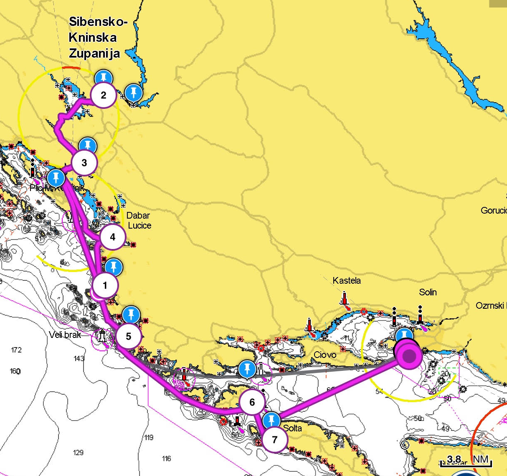

### На водопады — ~100 NM

| Дн. | Маршрут | Длина, NM | Примечание |
| --- | --- | ---: | --- |
| Вс | [Сплит]({{ site.baseurl }}/split/) → [Примоштен]({{ site.baseurl }}/primosten/) | ~27 | Ночёвка [на буях в Примоштен]({{ site.baseurl }}/primosten/#стоянка-на-буях) |
| Пн | [Примоштен]({{ site.baseurl }}/primosten/) → [Скрадин]({{ site.baseurl }}/skradin/) | ~18 | Ночёвка в [Skradin Marina]({{ site.baseurl }}/skradin/#skradin-marina) |
| Вт | [Скрадин]({{ site.baseurl }}/skradin/) → [Шибеник]({{ site.baseurl }}/sibenik/) | ~8 | Короткий переход к [D-Marin Mandalina]({{ site.baseurl }}/sibenik/#d-marin-mandalina) |
| Ср | [Шибеник]({{ site.baseurl }}/sibenik/) → [Оштрица]({{ site.baseurl }}/ostrica/) → [Рогожница]({{ site.baseurl }}/rogoznica/) | ~16 | Осмотр [сетны]({{ site.baseurl }}/ostrica/#северная-якорная-стоянка) и ночёвка в [Marina Frapa Rogoznica]({{ site.baseurl }}/rogoznica/#marina-frapa-rogoznica) |
| Чт | [Рогожница]({{ site.baseurl }}/rogoznica/) → [Древник]({{ site.baseurl }}/drvenik/) | ~13 | Ночёвка в [Голубой логуне]({{ site.baseurl }}/drvenik/#blue-lagoon) или переход на [Маслиница]({{ site.baseurl }}/maslinica/#martinis-marchi-marina) |
| Пт | [Древник]({{ site.baseurl }}/drvenik/) → [Маслиница]({{ site.baseurl }}/maslinica/) → [Сплит]({{ site.baseurl }}/split/) | ~17 | Завершение маршрута. Заправка на Маслинице или Сплит |

---

