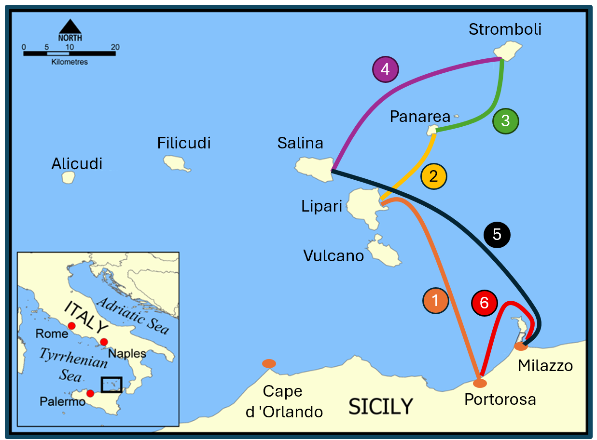

  <a href="{{ site.baseurl }}/" class="btn btn--info btn--large">Острова</a>

  <a href="{{ site.baseurl }}/routes/" class="btn btn--primary btn--large">Маршруты</a>
  
  <a href="{{ site.baseurl }}/winds/" class="btn btn--warning btn--large">Ветра</a>

### На водопады — ~120 NM

Маршрут по живописной центральной Далмации: от Сплита в сторону северных бухт и природных точек, затем выход к северным бергам и возвращение через защищённые стоянки. Хорош для экипажа, который хочет совместить плавание, купание и спокойную навигацию без слишком длинных переходов.

- вс [**Сплит**]({{ site.baseurl }}/split/) → [**Рогожница**]({{ site.baseurl }}/rogoznica/) *(~20 NM)*  
- пн [**Рогожница**]({{ site.baseurl }}/rogoznica/) → [**Скрадин**]({{ site.baseurl }}/skradin/) *(~27 NM)*  
- вт [**Скрадин**]({{ site.baseurl }}/skradin/) → [**Оштрица**]({{ site.baseurl }}/ostrica/) *(~22 NM)*  
- ср [**Оштрица**]({{ site.baseurl }}/ostrica/) → [**Древник**]({{ site.baseurl }}/drvenik/) *(~28 NM)*  
- чт [**Древник**]({{ site.baseurl }}/drvenik/) → [**Маслиница**]({{ site.baseurl }}/maslinica/) *(~8 NM)*  
- пт [**Маслиница**]({{ site.baseurl }}/maslinica/) → [**Сплит**]({{ site.baseurl }}/split/) *(~18 NM)*  

---

### Покругу — ~150 NM

Круговой маршрут по самым интересным стоянкам южной Далмации: спокойные бухты, исторические городки и хорошая балансировка между морскими переходами и береговыми прогулками. Подходит для экипажа, который хочет увидеть больше, но не перегружать неделю очень длинными днями.

- вс [**Сплит**]({{ site.baseurl }}/split/) → [**Древник**]({{ site.baseurl }}/drvenik/) *(~18 NM)*  
- пн [**Древник**]({{ site.baseurl }}/drvenik/) → [**Маслиница**]({{ site.baseurl }}/maslinica/) *(~24 NM)*  
- вт [**Маслиница**]({{ site.baseurl }}/maslinica/) → [**Милна**]({{ site.baseurl }}/milna/) *(~30 NM)*  
- ср [**Милна**]({{ site.baseurl }}/milna/) → [**Старый Град**] *(~32 NM)*  
- чт [**Старый Град**] → [**Бол**]({{ site.baseurl }}/milna/#marina-bol) *(~18 NM)*  
- пт [**Бол**]({{ site.baseurl }}/milna/#marina-bol) → [**Сплит**]({{ site.baseurl }}/split/) *(~32 NM)*  

---

