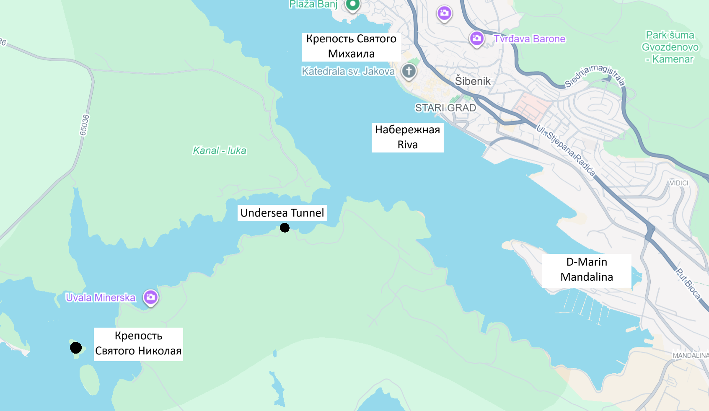
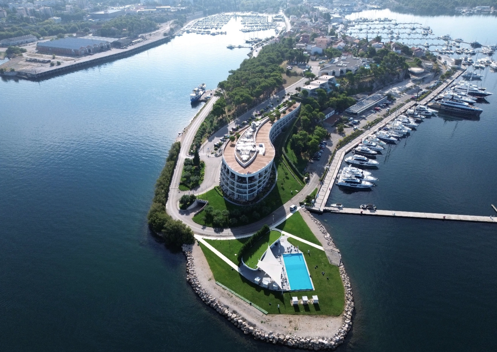
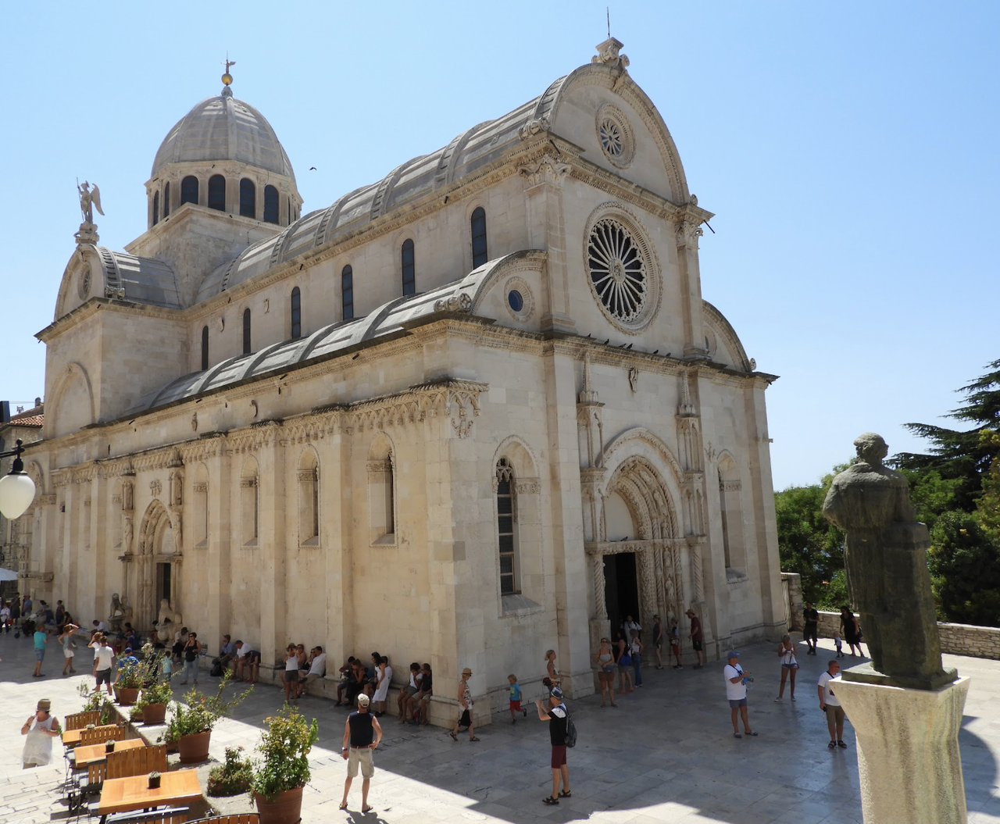
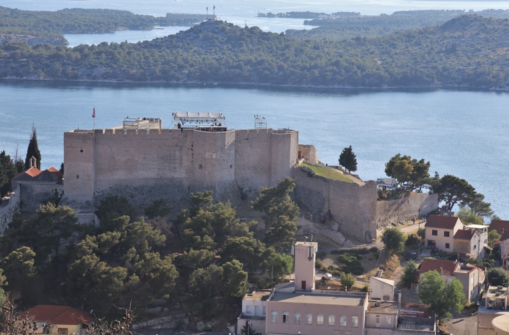
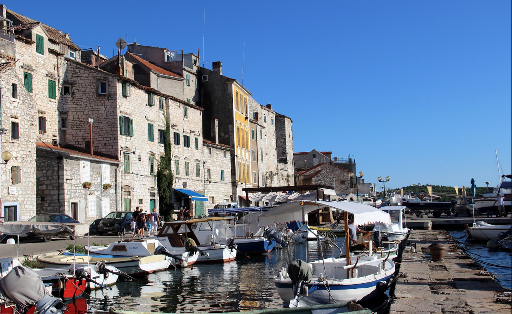
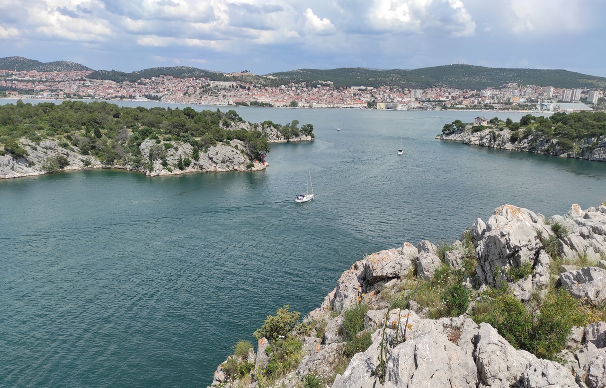
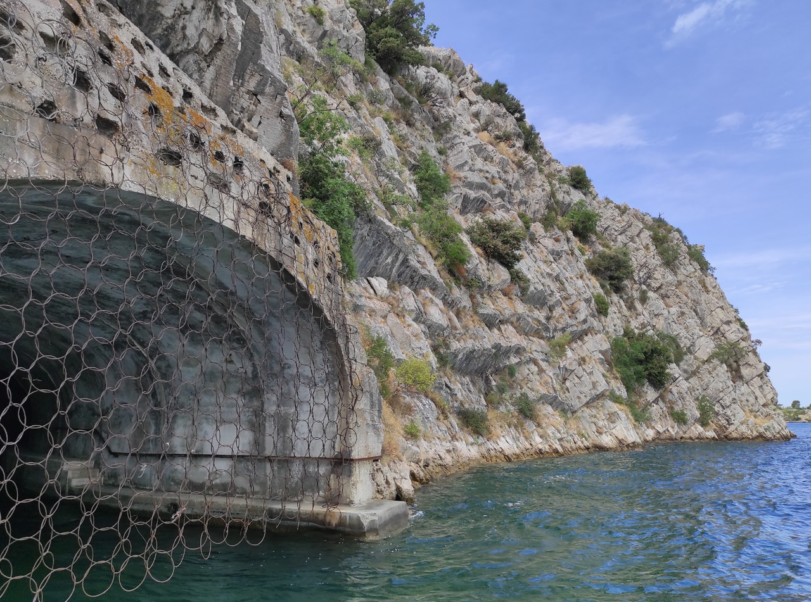
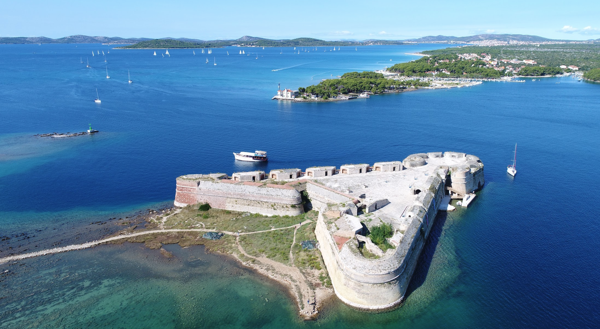

**Шибеник** — один из самых древних хорватских городов, построенный на берегу реки Крка в северной Далмации. Это первый город в регионе, построенный независимо от венецианской экспансии, и поэтому занимает особое место в хорватской истории. Город известен своим величественным кафедральным собором, признанным шедевром далматинского ренессанса, и оживлённой портовой атмосферой. Узкие улочки, уютные террасы и исторические памятники создают неповторимый облик средневекового города.

История Шибеника начинается в XI веке. Город развивался как важный морской порт и центр мощной хорватской династии. Сегодня Шибеник привлекает яхтсменов благодаря хорошим условиям для стоянки, богатому культурному наследию и удобному доступу к системе национального парка Крка.

## Марины и якорные стоянки

### D-Marin Mandalina

Современная марина в центре города, рассчитанная примерно на 450 яхт. Она находится немного в стороне от старого города, поэтому для поездки в центр обычно потребуется такси. В марине есть электричество, пресная вода, душевые, туалеты, ремонтные услуги, заправка дизелем и бензином, а также кафе и зоны для отдыха.

Стоимость стоянки летом обычно начинается от €80 за ночь. Марина хорошо защищена благодаря расположению в глубокой бухте и удобному входу в порт.

***VHF Channel 17***

`Координаты: 43° 43.10' N, 15° 53.98' E`

## Достопримечательности

### Кафедральный собор Св. Якова

Шедевр далматинского ренессанса, построенный в XV–XVI веках. Собор славится уникальной архитектурой, скульптурными украшениями и серией портретов известных людей на фасаде. Внутри сохранились произведения искусства эпохи Возрождения. Входная плата: €5. Лучший вид на собор открывается с барка или с холма над городом.

---

### St. Michael's Fortress

**Крепость Святого Михаила** — одна из главных исторических точек Шибеника, расположенная на небольшом холме у входа в бухту. Её возвели в период венецианского господства, и она служила важной оборонительной позицией, контролировавшей подходы к городу и портовой зоне. С высоты фортификации открывается впечатляющий вид на старый город, море и соседние островки.

Для яхтсменов это особенно интересное место, потому что крепость хорошо видна с воды и даёт ощущение исторического контекста всего региона. Здесь можно совместить прогулку по старому городу с подъёмом к укреплениям и фотографиями на фоне Адриатики. В ясную погоду вид с крепости на Шибеник и далматинский берег особенно красив.

---

### Набережная Riva

Главная прогулочная зона города: кафе, рестораны, небольшие магазины и живое дневное движение. Именно здесь лучше всего почувствовать атмосферу старого Шибеника — особенно вечером, когда город красиво подсвечивается и приходит время для ужина у воды.

---

### Канал Святого Антония

Канал Святого Антония — живописная морская прогулочная зона рядом с Шибеником с красивыми видами на море и сосновые берега. Вдоль канала проходит пешеходная тропа, ведущая к крепости Святого Николая, объекту Всемирного наследия ЮНЕСКО. По пути можно увидеть исторические военные сооружения и насладиться одними из лучших панорам в окрестностях города

---

### Undersea Tunnel

**Подземный туннель** в районе Шибеника — один из самых необычных исторических объектов в городе. Его связывают с оборонительными и инженерными работами, выполненными в эпоху, когда город был важной военной и торговой точкой на далматинском побережье. Туннель не столько туристическая достопримечательность, сколько живой след о том, как город адаптировался к военным и логистическим задачам.

Для посетителей он интересен как редкий пример подземной инженерии, а для яхтсменов — как часть общего исторического контекста, который дополняет прогулку по крепостям и старому городу. Это хороший объект для тех, кто хочет увидеть не только морские виды, но и глубину средневекового и раннего современного Шибеника.

---

### St. Nicholas' Fortress

**Крепость Святого Николая** — ещё один важный оборонительный объект, расположенный в районе входа в бухту. Она хорошо видна с моря и дополняет образ Шибеника как города, который долго защищал своё побережье и порт. С точки зрения яхтсмена это особенно интересно: крепость — один из самых эффектных ориентиров при подходе к бухте, а её историческое значение помогает понять, насколько важным был Шибеник в стратегическом отношении.

Её соединяют с оборонительной системой города, включавшей береговые укрепления и наблюдательные посты. В совокупности все эти объекты создают целостную картину: Шибеник не просто живописный город, но и исторический порт, который защищал себя и торговый путь вдоль Адриатики.

---

