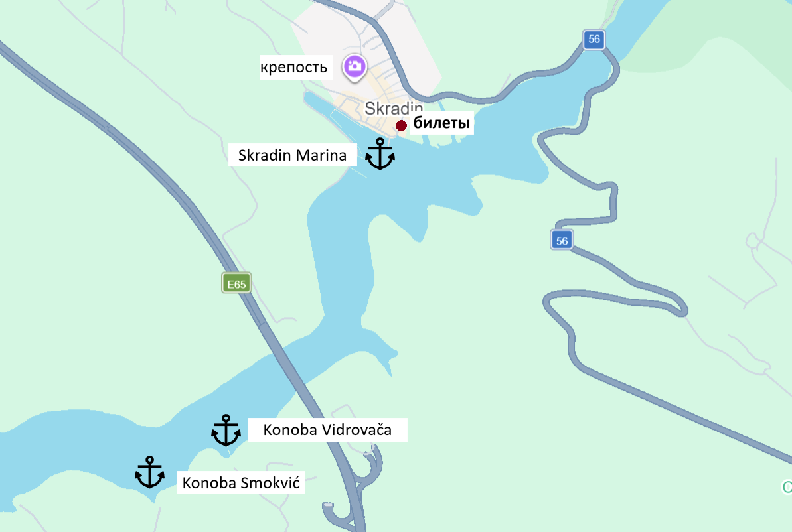
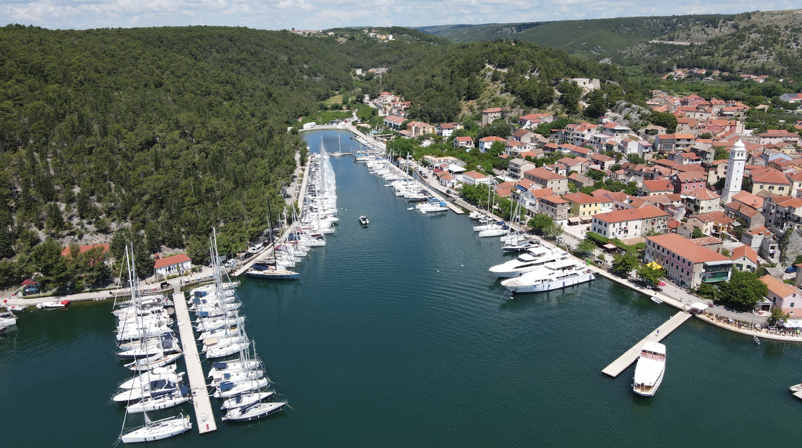
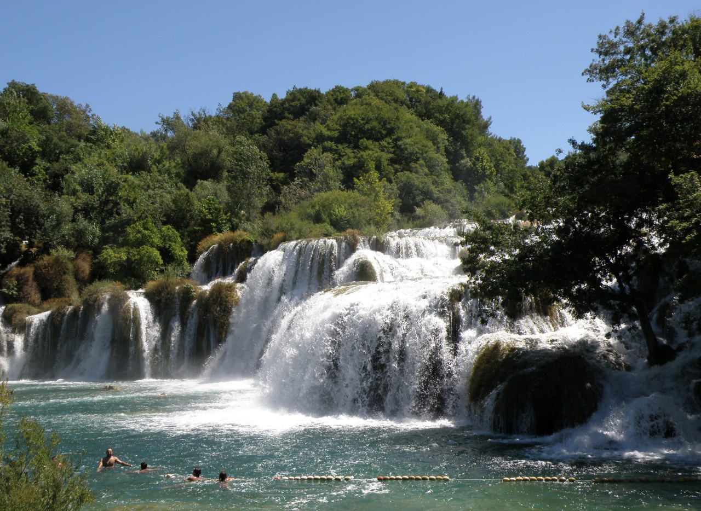
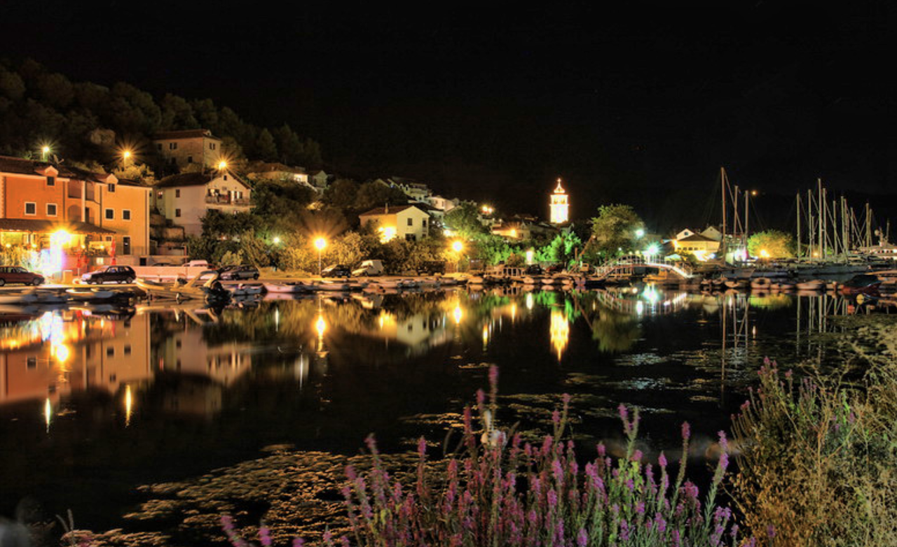
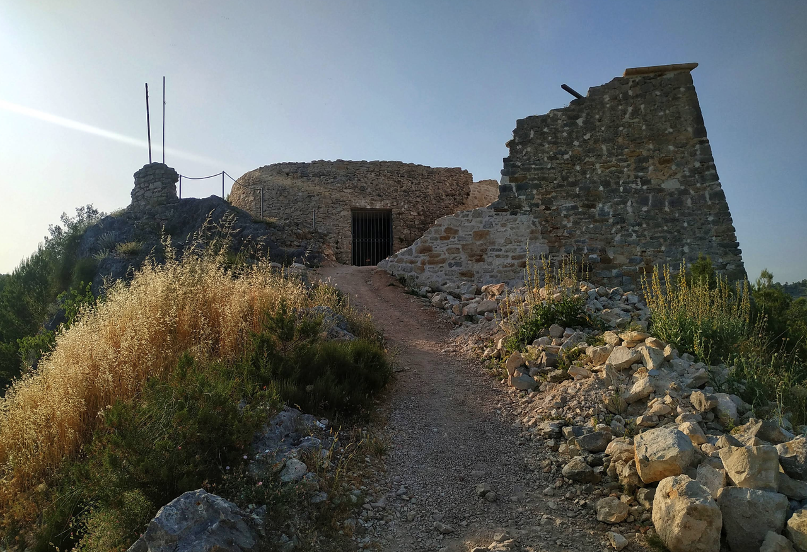

**Скрадин** — исторический портовый городок, расположенный в 50–55 км от Сплита, в устье реки Крка. Это необычное место, где река встречается с морем, создавая уникальное географическое положение. Скрадин известен как главные морские ворота национального парка Крка и служит идеальной базой для экскурсий вверх по реке. Город сохранил богатое средневековое наследие и характеризуется спокойной портовой атмосферой.

История Скрадина насчитывает более тысячи лет. Город был важным портом и центром торговли в эпоху Средневековья и Возрождения. Сегодня Скрадин остаётся значимой точкой для яхтсменов, посещающих национальный парк Крка, и служит базой для экскурсий.

## Марины и якорные стоянки

Скрадин имеет особые условия для стоянки яхт благодаря расположению в устье реки Крка. Подход требует осторожности при низкой воде; рекомендуется заранее уточнить глубину на входе. Порт защищён от морских волн, но подвержен речным течениям.

### Skradin Marina

Небольшая марина, рассчитанная примерно на 50–70 яхт, расположена в центре города. Предоставляет основные услуги: причалы с электричеством и водой, ремонт, заправка дизелем, душевые, туалеты, рестораны.

Стоимость стоянки летом (июнь–сентябрь): €35–60 за ночь, межсезонье: €25–35. Цена включает электричество и пресную воду. Марина имеет хорошую защиту благодаря расположению в устье реки.

В непосредственной близости: рестораны с видом на реку, кафе, магазины, туристический центр. Возможна аренда велосипедов.

`Координаты: 43° 43.05' N, 15° 47.70' E`

### Запасные стоянки

**River Mouth Anchorage** - якорная стоянка у устья реки Крка. Глубина 4–6 м, грунт — песок и ил, якорь держит. Укрытие от всех ветров благодаря расположению в устье реки.

`Координаты: 43° 43.35' N, 15° 47.55' E`

**South Bay** - открытая якорная стоянка к югу от города с защитой от северных ветров. Глубина 6–8 м. Расстояние до города примерно 300 м.

`Координаты: 43° 42.70' N, 15° 47.85' E`

---

## Достопримечательности

### Национальный парк Крка

Главная достопримечательность Скрадина. Река Крка с её системой озёр и водопадов является одной из самых красивых природных достопримечательностей Хорватии. Экскурсии на лодке вверх по реке доступны ежедневно. Вход в парк: €15. Полдневная экскурсия рекомендуется.

### Старый город Скрадин

Узкие улочки средневекового городка, исторические дома и оборонительные стены. На набережной реки расположены кафе и рестораны с видом на Крку. Атмосфера спокойная и историческая.

### Руины крепости

На холме над городом сохранились руины средневековой крепости. Подъём на холм предоставляет панорамные виды на город, реку и окружающий ландшафт. Доступна прогулка по развалинам.

### Рыба и местная кухня

Скрадин славится свежей рыбой и речными деликатесами. На набережной работают рестораны, где подают камбалу, форель и других местных рыб. Рекомендуется ужин с видом на реку на закате.

---
