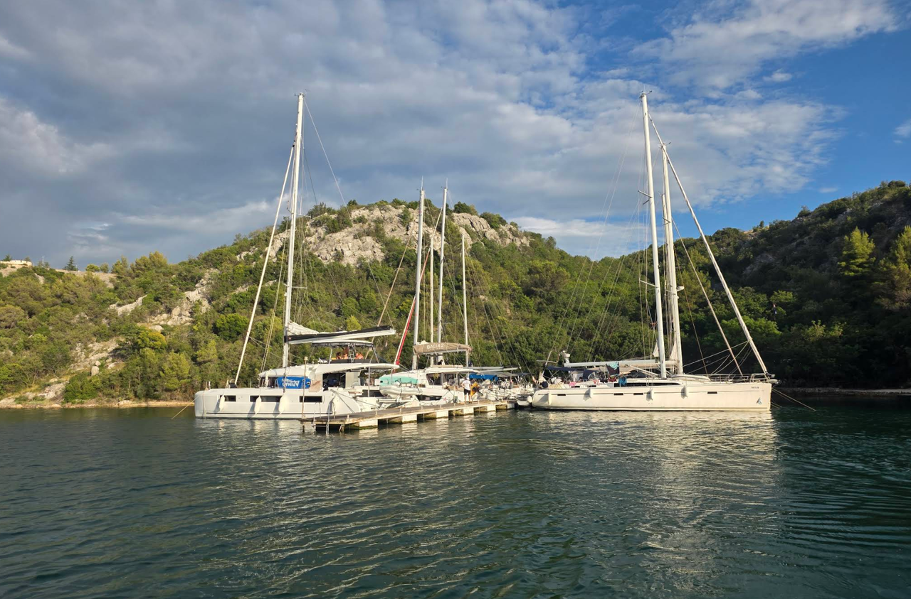
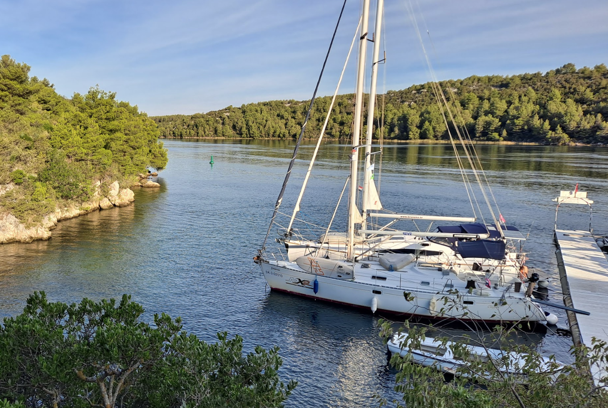

**Скрадин** — исторический портовый городок, расположенный в 50–55 км от Сплита, в устье реки Крка. Это необычное место, где река встречается с морем, создавая уникальное географическое положение. Скрадин известен как главные морские ворота национального парка Крка и служит идеальной базой для экскурсий вверх по реке. Город сохранил богатое средневековое наследие и характеризуется спокойной портовой атмосферой.

История Скрадина насчитывает более тысячи лет. Город был важным портом и центром торговли в эпоху Средневековья и Возрождения. Сегодня Скрадин остаётся значимой точкой для яхтсменов, посещающих национальный парк Крка, и служит базой для экскурсий.

## Марины и якорные стоянки

Скрадин имеет особые условия для стоянки яхт благодаря расположению в устье реки Крка. Подход требует осторожности при низкой воде; рекомендуется заранее уточнить глубину на входе. Порт защищён от морских волн, но подвержен речным течениям.

### Skradin Marina

Небольшая марина, рассчитанная примерно на 50–70 яхт, расположена в центре города. Предоставляет основные услуги: причалы с электричеством и водой, ремонт, заправка дизелем, душевые, туалеты, рестораны.

Стоимость стоянки летом (июнь–сентябрь): €35–60 за ночь, межсезонье: €25–35. Цена включает электричество и пресную воду. Марина имеет хорошую защиту благодаря расположению в устье реки.

В непосредственной близости: рестораны с видом на реку, кафе, магазины, туристический центр. Возможна аренда велосипедов.

`Координаты: 43° 43.05' N, 15° 47.70' E`

## Достопримечательности

### Национальный парк Крка

Главная достопримечательность Скрадина. Река Крка с её системой озёр и водопадов является одной из самых красивых природных достопримечательностей Хорватии. Экскурсии на лодке вверх по реке доступны ежедневно. Вход в парк: €15. Полдневная экскурсия рекомендуется.

---

### Экскурсия на водопад

Парк начинает работу с 8 утра до 6 вечера.
Билетные кассы находятся в восточной части города.

Для утренней поездки из Скрадина оптимально ехать на официальный катер **NP Krka** до **Skradinski buk**, главного каскада водопадов.

Билет нужно купить/получить в офисе **NP Krka** в Скрадине до посадки на катер.
Катер: Skradin → Skradinski buk, в пути примерно 20 минут. Обратный катер идет тем же маршрутом. 

Прайс по билетам: [прайс](https://www.npkrka.hr/wp-content/uploads/CJENIK-2026-ENG.pdf)

---

### Старый город Скрадин

Узкие улочки средневекового городка, исторические дома и оборонительные стены. На набережной реки расположены кафе и рестораны с видом на Крку. Атмосфера спокойная и историческая.

---

### Руины крепости

На холме над городом сохранились руины средневековой крепости. Подъём на холм предоставляет панорамные виды на город, реку и окружающий ландшафт. Доступна прогулка по развалинам.

---

### Рыба и местная кухня

Скрадин славится свежей рыбой и речными деликатесами. На набережной работают рестораны, где подают камбалу, форель и других местных рыб. 

---

### Konoba Vidrovača - пантоны

Отлично подходит для остановки на яхте: у ресторана есть понтон примерно на 20 мурингов, а для гостей ресторана швартовка бесплатна; по данным обзора 2026 года, на причале доступны вода и электричество, глубины составляют примерно от 2 м во внутренней части до 6 м у края. Кухня далматинская с упором на свежую рыбу и морепродукты.

Устрицы есть в официальном меню 2026 года.
Oysters: 6 € за штуку минимальный заказ: 3 шт., то есть минимум 18 €

Меню и резервация : [https://vidrovaca.com/](https://vidrovaca.com/)

**телефон +385 99 365 7555**

`Координаты: 43° 48.38' N, 15° 54.73' E`

---

### Konoba Smokvić - пантоны

Ресторан специализируется на морепродуктах. Есть понтоны для остановки. Вода и электричество отсутствуют. В меню есть морепродукты: мидии, кальмары, рыба и мясо.

**телефон +385 99 594 892**

`Координаты: 43° 48.32' N, 15° 54.48' E`

