**Сплит** считается одной из лучших яхтенных баз на Адриатике. Город расположен в центре далматинского побережья и является удобной отправной точкой для круизов к островам Брач, [Шолта](/maslinica/), Хвар и Вис.

Для яхтсменов главное преимущество Сплита в том, что здесь сочетаются развитая морская инфраструктура, международный аэропорт и полноценный город с ресторанами, магазинами и историческим центром.

Атмосфера здесь очень «морская»: парусный спорт является важной частью местной культуры, а марину можно использовать не только как место стоянки, но и как базу для знакомства с одним из самых красивых исторических городов Хорватии

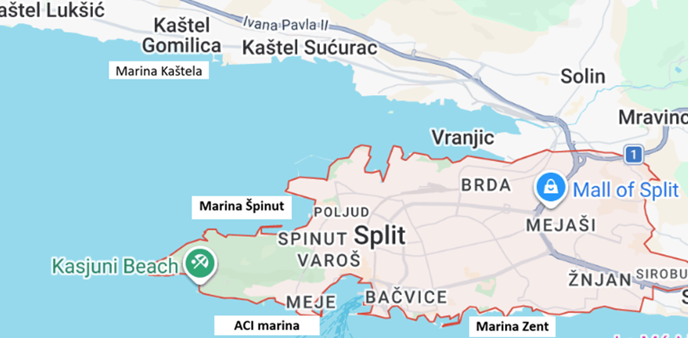

## Марины 

### Marina Kaštela

Считается одной из лучших и крупнейших марин центральной Далмации. Она находится в Kaštel Gomilica, между Сплитом и Трогиром, всего примерно в 7 км от аэропорта Сплита. Гавань хорошо защищена от волн и ветра в Каштельском заливе. Цены от 80 евро ночь.

400 мест с подключением воды и электричества.

 В марине имеются:
- 24/7 охрана и помощь маринеров;
- вода и электричество на причалах;
- Wi‑Fi;
- душевые и санузлы;
- прачечная;
- технический сервис;
- магазин яхтенного оборудования

На территории есть 
- ресторан Spinnaker;
- ресторан Nautic;
- парусный центр;
- крытый бассейн длиной 25 м.

**VHF channel 17**

`Координаты: 43° 32.73' N, 16° 24.10' E`

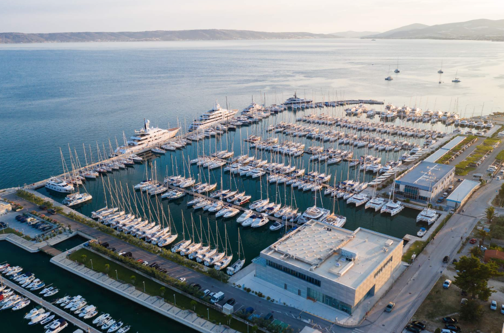

---

###  ACI marina Split 

Это самая центральная марина Сплита, расположенная в бухте Baluni, прямо у подножия парка Марьян. До набережной Riva и дворца Диоклетиана можно дойти пешком примерно за 10-15 минут. Супермаркеты Konzum и Tommy в пешей доступности. Цены от 100 евро за ночь

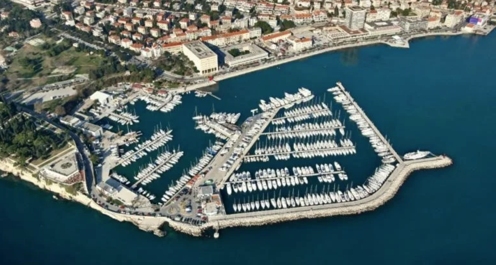

В марине есть:
- вода и электричество на причалах;
- Wi‑Fi;
- душевые и туалеты; прачечная;
- магазин яхтенного оборудования;
- сервис и ремонт лодок;
- парковка
- заправка дизель. 

**VHF channel 10**

`Координаты: 43° 30.15' N, 16° 25.88' E`

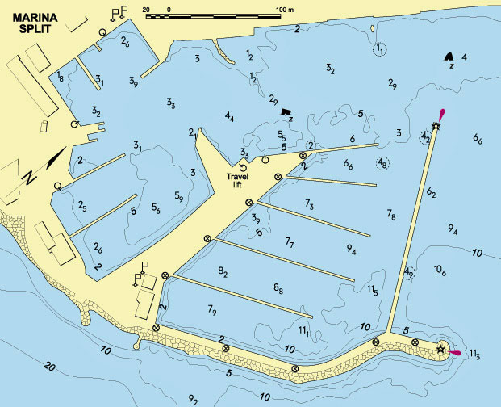

---

### Marina Špinut

Марина для тех, кто хочет стоять почти в центре города, но в гораздо более спокойной атмосфере, чем ACI Marina Split. По отзывам, персонал грубоват и нет душей и туалетов. 

`Координаты: 43° 30.93' N, 16° 25.07' E`

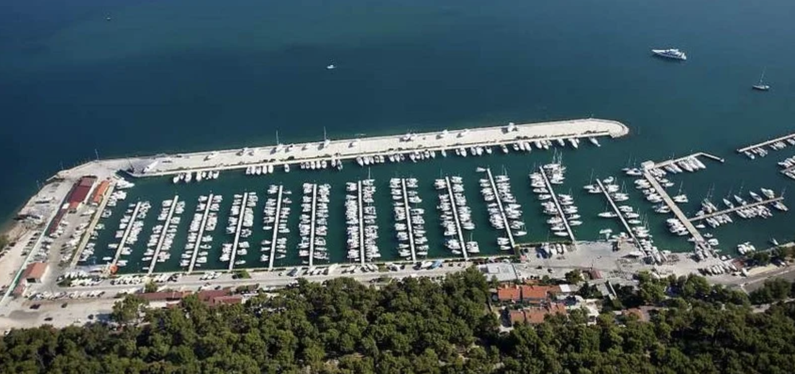

---

### Marina Zent и Lučica Zenta
**Лучица Зента** — небольшая яхтенная гавань в восточной части Сплита, между пляжами Firule и Žnjan. Это скорее сервисная и местная марина. Количество мест сильно ограничено. Удобно для кратковременной стоянки

в марине имеются:
- есть собственная парковочная зона 
- сухое хранение лодок;
- сервисная зона;  
- охраняемая территория;
- вода и электричество
  
 VHF channel 17, 16.

`Координаты: 43° 30.00' N, 16° 27.65' E`

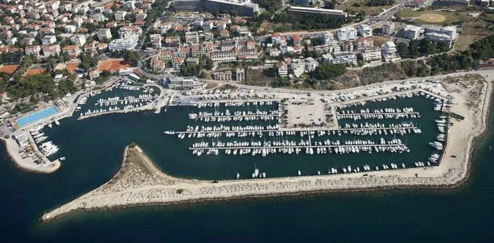

## Достопримечательности

### Дворец Диоклетиана. 
Сердце города и объект Всемирного наследия ЮНЕСКО. Это огромный римский дворец IV века, вокруг которого вырос современный Сплит. Уникально то, что это не музей, а живой городской квартал с домами, кафе и магазинами внутри древних стен. Находится в центре города и открыт для входа 

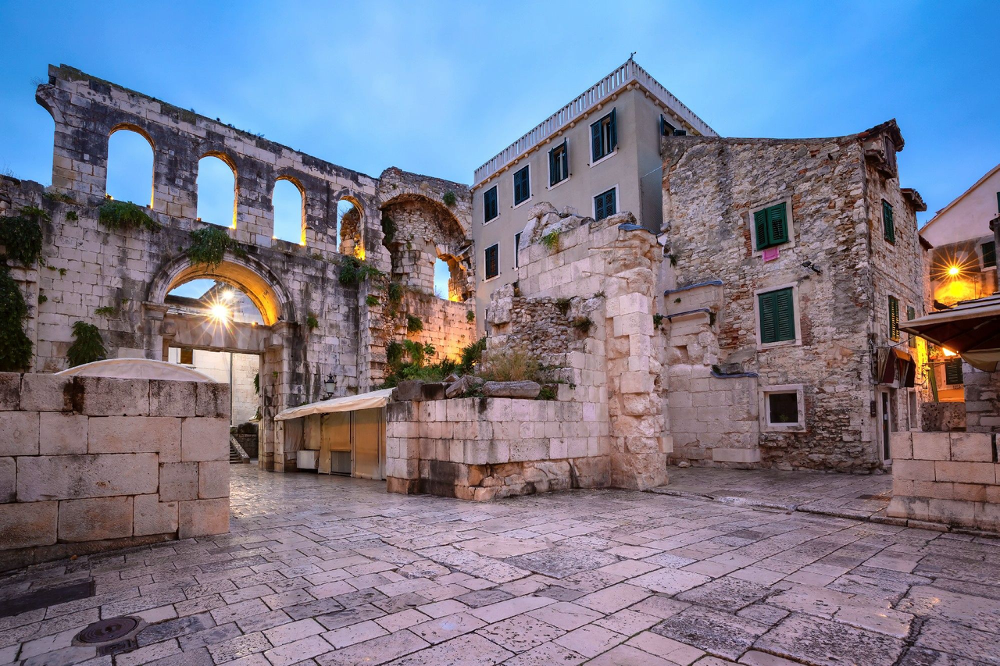

### Подземелья (Cellars) дворца Диоклетиана
Один из самых хорошо сохранившихся античных подземных комплексов Европы. Билет обычно около 6-9 €. Летом обычно работают примерно 09:00-20:00.

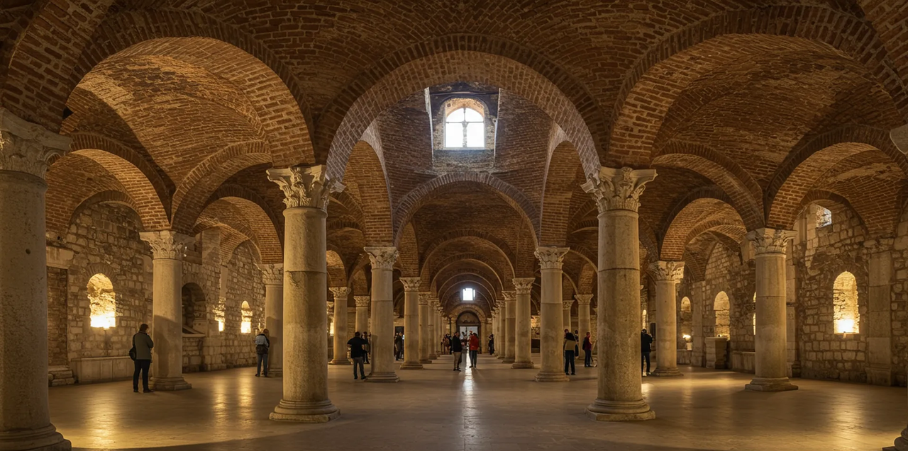

### Собор Святого Домния (St. Domnius). 
Один из самых необычных соборов Европы. Он был создан на основе мавзолея самого императора Диоклетиана. Билет от 7 евро. Есть возможность подъёма на колокольню. С колокольни открывается один из лучших видов на красные крыши Сплита и Адриатику. В летний сезон обычно открыт примерно 09:00-19:00

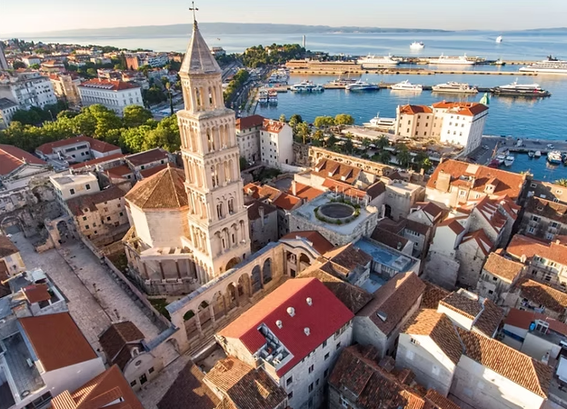

### Перистиль. 
Центральная площадь дворца с прекрасно сохранившейся римской архитектурой. Вечером здесь часто проходят концерты и культурные мероприятия.

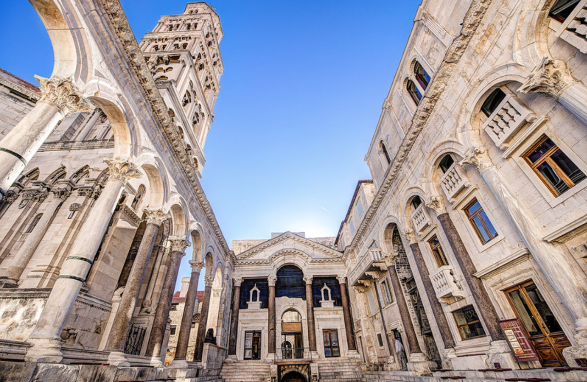

### Музей игры престолов (Game of Thrones Museum).
Музей посвящён сериалу «Игра престолов» и сценам, снимавшимся в Сплите, который в сериале изображал город Миэрин.
В музее представлены реплики оружия, костюмы, фигуры персонажей, диорамы городов Вестероса и тематические экспозиции для фотографий.
Это небольшой музей, который особенно нравится поклонникам сериала и хорошо дополняет прогулку по местам съёмок в Сплите. 
Работает ежедневно: 10:00–17:00. Вход 15 евро.

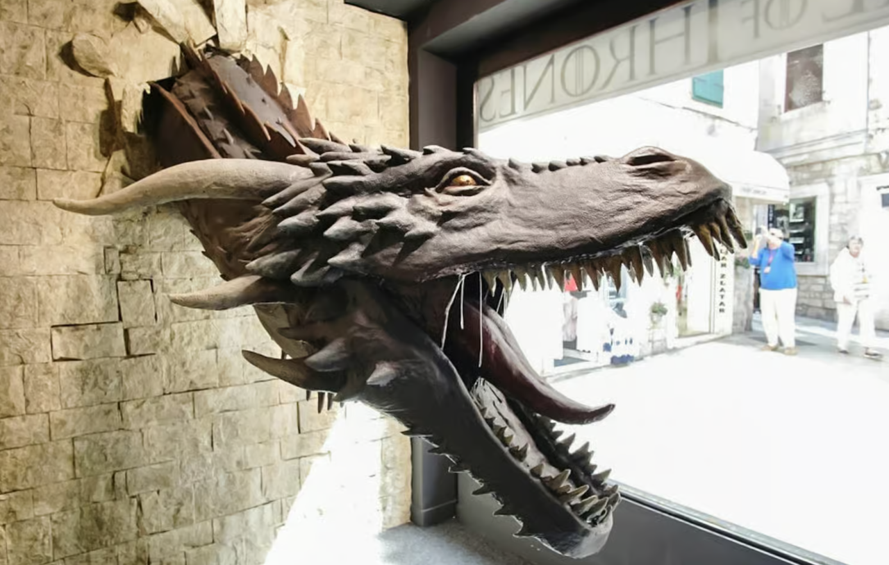

### Галерея Мештровича. 
Если интересует искусство, обязательно посетите музей самого известного хорватского скульптора Ивана Мештровича. Взрослый билет: 12 €. Работает вт-вс 08:00-18:00, понедельник выходной

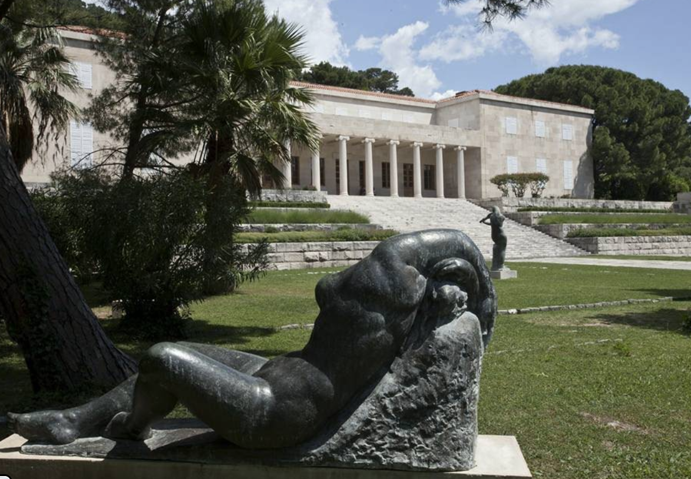