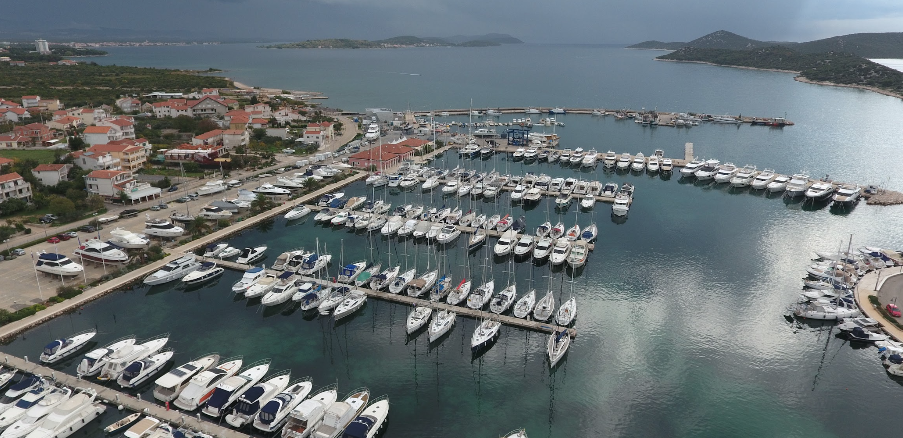
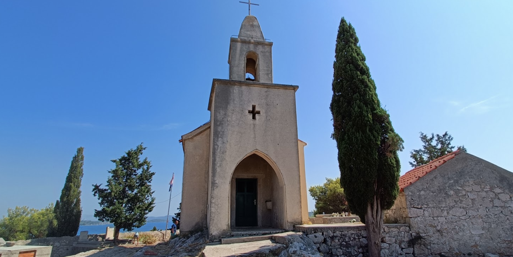
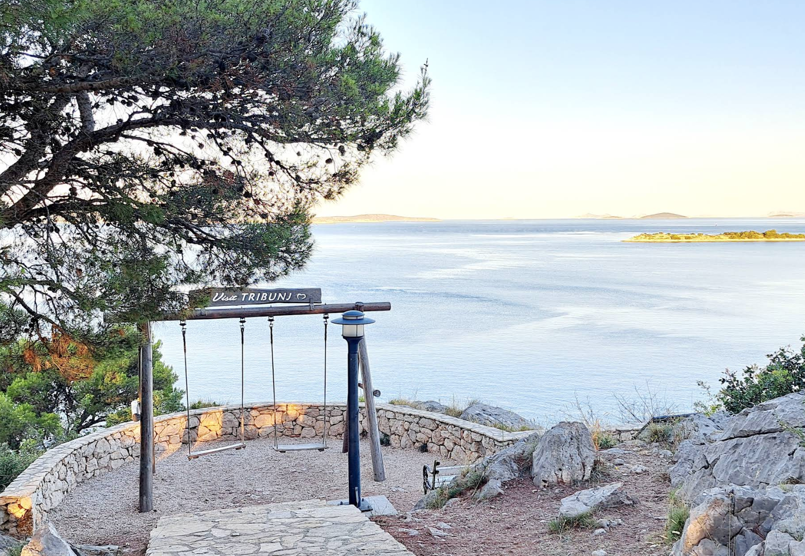

**Трибуня** — небольшой курортный посёлок на далматинском побережье, известный как удобная точка для коротких стоянок и спокойного отдыха в тени скалистых берегов. Посёлок расположен в северной Далмации, между более крупными яхтенными базами, и отлично подходит для переходов вдоль побережья, когда хочется выйти в море без лишней городской суеты.

Трибуня привлекает небольшими бухтами, чистой водой и удобным доступом к берегу. Для яхтсменов это прежде всего удобная опорная точка: здесь можно быстро зайти в порт, заночевать, отдохнуть и продолжить маршрут к северу или к югу.

Недалеко от марины есть небольшой магазин **Konzum**, а также кафе и рестораны на набережной.

## Марины и якорные стоянки

### D-Marin Marina Tribunj

Это главная и наиболее удобная марина в районе. Она подходит как для короткой ночёвки, так и для более длительной стоянки во время путешествия вдоль далматинского побережья. Марина расположена близко к пляжам и к центру посёлка, поэтому после швартовки не нужно тратить время на транспорт или долгую прогулку до береговой инфраструктуры.

Для яхтсмена здесь важно сочетание удобного доступа, защищённой стоянки и базовой инфраструктуры: вода, электричество, Wi‑Fi, санитарные блоки, сервисный доступ и возможность быстро добраться до кафе, магазинов и набережной. В сезон она обычно перегружена, поэтому бронирование лучше делать заранее.

**Услуги в марине:**
- стоянка для яхт и катеров;
- вода и электричество на причалах;
- Wi‑Fi;
- душевые и туалеты;
- сервис и ремонт яхт;
- удобный доступ к берегу и посёлку.

***VHF Channel 17***

`Координаты: 43° 45.23' N, 15° 44.80' E`

## Достопримечательности

### Церковь Святого Николая

Церковь Святого Николая — одна из главных точек притяжения в центре Трибуни. Это небольшое, но очень атмосферное сооружение, которое хорошо вписывается в характер местного поселения: спокойная приморская архитектура, узкие улочки и близость к морю. Прогулка к церкви хорошо сочетается с вечерней прогулкой по набережной и остановкой в местном ресторане.

---

### Качели/«Swing»

В районе береговой линии Трибуни находится одна из самых живописных точек для фото и короткого отдыха — место, известное как «Swing». Это не столько отдельная историческая достопримечательность, сколько атмосферная зона с красивым видом на море, скалы и береговую линию. Для путешественников это удобно: можно выйти на прогулку с яхты, провести время на берегу и сделать несколько хороших панорамных снимков.

---

## Почему Трибуня хороша для яхтсмена

- тихая и удобная стоянка по сравнению с более крупными курортами;
- хорошая база для коротких остановок вдоль побережья;
- удобный вход к берегу и быстрый доступ к посёлку;
- спокойная атмосфера, особенно в межсезонье;
- приятный вариант для отдыха после дня в открытом море.

Если хочется сочетать спокойную стоянку, доступ к берегу и не слишком шумный курорт, Трибуня — очень удачный вариант для прогулки по далматинскому побережью.

